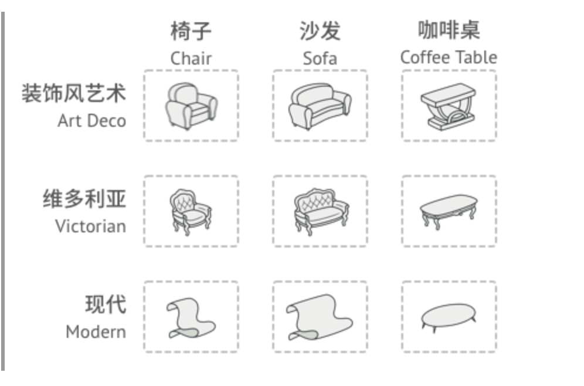
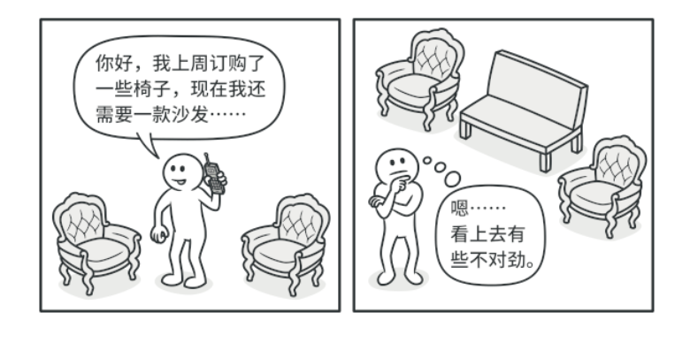

**抽象工厂模式**是一种创建型设计模式， 它能**创建一系列相关的对象， 而无需指定其具体类**。


问题
--

假设你正在开发一款家具商店模拟器。 你的代码中包括一些类， 用于表示：

1.  一系列相关产品， 例如 `椅子`Chair 、 ​ `沙发`Sofa 和 `咖啡桌`Coffee­Table 。
    
2.  系列产品的不同变体。 例如， 你可以使用 `现代`Mordern 、 ​ `维多利亚`Victorian 、 ​ `装饰风艺术`Art­Deco 等风格生成 `椅子` 、 ​ `沙发`和 `咖啡桌` 。

 


系列产品及其不同变体。

你需要设法单独生成每件家具对象， 这样才能确保其风格一致。 如果顾客收到的家具风格不一样， 他们可不会开心。



现代风格的沙发和维多利亚风格的椅子不搭。

此外， 你也不希望在添加新产品或新风格时修改已有代码。 家具供应商对于产品目录的更新非常频繁， 你不会想在每次更新时都去修改核心代码的。

解决方案
----

首先， 抽象工厂模式建议**为系列中的每件产品明确声明接口** （例如椅子、 沙发或咖啡桌）。 然后， **确保所有产品变体都继承这些接口**。 例如， 所有风格的椅子都实现 `椅子`接口； 所有风格的咖啡桌都实现 `咖啡桌`接口， 以此类推。


同一对象的所有变体都必须放置在同一个类层次结构之中。

接下来， 我们需要声明**抽象工厂——包含系列中所有产品构造方法的接口**。 例如 `create­Chair`创建椅子 、 ​ `create­Sofa`创建沙发和 `create­Coffee­Table`创建咖啡桌 。 这些方法必须返回**抽象**产品类型， 即我们之前抽取的那些接口： ​ `椅子` ， ​ `沙发`和 `咖啡桌`等等。


每个具体工厂类都对应一个特定的产品变体。

那么该如何处理产品变体呢？ 对于系列产品的每个变体， 我们都将**基于 `抽象工厂`接口创建不同的工厂类**。 **每个工厂类都只能返回特定类别的产品**， 例如， ​ `现代家具工厂`Modern­Furniture­Factory 只能创建 `现代椅子`Mordern­Chair 、 ​ `现代沙发`Modern­Sofa 和 `现代咖啡桌`Modern­Coffee­Table 对象。

客户端代码可以通过相应的抽象接口调用工厂和产品类。 你无需修改实际客户端代码， 就能更改传递给客户端的工厂类， 也能更改客户端代码接收的产品变体。


客户端无需了解其所调用工厂的具体类信息。

假设**客户端想要工厂创建一把椅子。 客户端无需了解工厂类， 也不用管工厂类创建出的椅子类型**。 无论是现代风格， 还是维多利亚风格的椅子， 对于客户端来说没有分别， 它只需调用抽象 `椅子`接口就可以了。 这样一来， 客户端只需知道椅子以某种方式实现了 `sit­On`坐下方法就足够了。 此外， 无论工厂返回的是何种椅子变体， 它都会和由同一工厂对象创建的沙发或咖啡桌风格一致。

最后一点说明： 如果客户端仅接触抽象接口， 那么谁来创建实际的工厂对象呢？ 一般情况下， 应用程序会在初始化阶段创建具体工厂对象。 而在此之前， 应用程序必须根据配置文件或环境设定选择工厂类别。

抽象工厂模式结构
--------

1.  **抽象产品** （Abstract Product） 为构成系列产品的一组不同但相关的产品声明接口。
    
2.  **具体产品** （Concrete Product） 是抽象产品的多种不同类型实现。 所有变体 （维多利亚 / 现代） 都必须实现相应的抽象产品 （椅子 / 沙发）。
    
3.  **抽象工厂** （Abstract Factory） 接口声明了一组创建各种抽象产品的方法。
    
4.  **具体工厂** （Concrete Factory） 实现抽象工厂的构建方法。 每个具体工厂都对应特定产品变体， 且仅创建此种产品变体。
    
5.  尽管具体工厂会对具体产品进行初始化， 其构建方法签名必须返回相应的_抽象_产品。 这样， 使用工厂类的客户端代码就不会与工厂创建的特定产品变体耦合。 **客户端** （Client） 只需通过抽象接口调用工厂和产品对象， 就能与任何具体工厂 / 产品变体交互。
    

伪代码
---

下面例子通过应用**抽象工厂**模式， 使得客户端代码无需与具体 UI 类耦合， 就能创建跨平台的 UI 元素， 同时确保所创建的元素与指定的操作系统匹配。


跨平台 UI 类示例。

跨平台应用中的相同 UI 元素功能类似， 但是在不同操作系统下的外观有一定差异。 此外， 你需要确保 UI 元素与当前操作系统风格一致。 你一定不希望在 Windows 系统下运行的应用程序中显示 macOS 的控件。

抽象工厂接口声明一系列构建方法， 客户端代码可调用它们生成不同风格的 UI 元素。 每个具体工厂对应特定操作系统， 并负责生成符合该操作系统风格的 UI 元素。

其运作方式如下： 应用程序启动后检测当前操作系统。 根据该信息， 应用程序通过与该操作系统对应的类创建工厂对象。 其余代码使用该工厂对象创建 UI 元素。 这样可以避免生成错误类型的元素。

使用这种方法， 客户端代码只需调用抽象接口， 而无需了解具体工厂类和 UI 元素。 此外， 客户端代码还支持未来添加新的工厂或 UI 元素。

这样一来， 每次在应用程序中添加新的 UI 元素变体时， 你都无需修改客户端代码。 你只需创建一个能够生成这些 UI 元素的工厂类， 然后稍微修改应用程序的初始代码， 使其能够选择合适的工厂类即可。

```
// 抽象工厂接口声明了一组能返回不同抽象产品的方法。这些产品属于同一个系列
// 且在高层主题或概念上具有相关性。同系列的产品通常能相互搭配使用。系列产
// 品可有多个变体，但不同变体的产品不能搭配使用。
interface GUIFactory is
    method createButton():Button
    method createCheckbox():Checkbox


// 具体工厂可生成属于同一变体的系列产品。工厂会确保其创建的产品能相互搭配
// 使用。具体工厂方法签名会返回一个抽象产品，但在方法内部则会对具体产品进
// 行实例化。
class WinFactory implements GUIFactory is
    method createButton():Button is
        return new WinButton()
    method createCheckbox():Checkbox is
        return new WinCheckbox()

// 每个具体工厂中都会包含一个相应的产品变体。
class MacFactory implements GUIFactory is
    method createButton():Button is
        return new MacButton()
    method createCheckbox():Checkbox is
        return new MacCheckbox()


// 系列产品中的特定产品必须有一个基础接口。所有产品变体都必须实现这个接口。
interface Button is
    method paint()

// 具体产品由相应的具体工厂创建。
class WinButton implements Button is
    method paint() is
        // 根据 Windows 样式渲染按钮。

class MacButton implements Button is
    method paint() is
        // 根据 macOS 样式渲染按钮

// 这是另一个产品的基础接口。所有产品都可以互动，但是只有相同具体变体的产
// 品之间才能够正确地进行交互。
interface Checkbox is
    method paint()

class WinCheckbox implements Checkbox is
    method paint() is
        // 根据 macOS 样式渲染复选框。

class MacCheckbox implements Checkbox is
    method paint() is
        // 根据 macOS 样式渲染复选框。

// 客户端代码仅通过抽象类型（GUIFactory、Button 和 Checkbox）使用工厂
// 和产品。这让你无需修改任何工厂或产品子类就能将其传递给客户端代码。
class Application is
    private field factory: GUIFactory
    private field button: Button
    constructor Application(factory: GUIFactory) is
        this.factory = factory
    method createUI() is
        this.button = factory.createButton()
    method paint() is
        button.paint()


// 程序会根据当前配置或环境设定选择工厂类型，并在运行时创建工厂（通常在初
// 始化阶段）。
class ApplicationConfigurator is
    method main() is
        config = readApplicationConfigFile()

        if (config.OS == "Windows") then
            factory = new WinFactory()
        else if (config.OS == "Mac") then
            factory = new MacFactory()
        else
            throw new Exception("错误！未知的操作系统。")

        Application app = new Application(factory)


```

抽象工厂模式适用性
---------

如果代码需要与多个不同系列的相关产品交互， 但是由于无法提前获取相关信息， 或者出于对未来扩展性的考虑， 你不希望代码基于产品的具体类进行构建， 在这种情况下， 你可以使用抽象工厂。

抽象工厂为你提供了一个接口， 可用于创建每个系列产品的对象。 只要代码通过该接口创建对象， 那么你就不会生成与应用程序已生成的产品类型不一致的产品。

如果你有一个基于一组抽象方法的类， 且其主要功能因此变得不明确， 那么在这种情况下可以考虑使用抽象工厂模式。

在设计良好的程序中， 每个类仅负责一件事。 如果一个类与多种类型产品交互， 就可以考虑将工厂方法抽取到独立的工厂类或具备完整功能的抽象工厂类中。

实现方式
----

1.  以不同的产品类型与产品变体为维度绘制矩阵。
    
2.  为所有产品声明抽象产品接口。 然后让所有具体产品类实现这些接口。
    
3.  声明抽象工厂接口， 并且在接口中为所有抽象产品提供一组构建方法。
    
4.  为每种产品变体实现一个具体工厂类。
    
5.  在应用程序中开发初始化代码。 该代码根据应用程序配置或当前环境， 对特定具体工厂类进行初始化。 然后将该工厂对象传递给所有需要创建产品的类。
    
6.  找出代码中所有对产品构造函数的直接调用， 将其替换为对工厂对象中相应构建方法的调用。
    

抽象工厂模式优缺点
---------

*   你可以确保同一工厂生成的产品相互匹配。
*   你可以避免客户端和具体产品代码的耦合。
*   单一职责原则。 你可以将产品生成代码抽取到同一位置， 使得代码易于维护。
*   开闭原则。 向应用程序中引入新产品变体时， 你无需修改客户端代码。

*   由于采用该模式需要向应用中引入众多接口和类， 代码可能会比之前更加复杂。

与其他模式的关系
--------

*   在许多设计工作的初期都会使用[工厂方法](../factory/index.md)模式 （较为简单， 而且可以更方便地通过子类进行定制）， 随后演化为使用抽象工厂模式、 [原型模式](../prototype/index.md)或[生成器模式](../builder/index.md) （更灵活但更加复杂）。
    
*   生成器重点关注如何分步生成复杂对象。 抽象工厂专门用于生产一系列相关对象。 _抽象工厂_会马上返回产品， _生成器_则允许你在获取产品前执行一些额外构造步骤。
    
*   抽象工厂模式通常基于一组工厂方法， 但你也可以使用原型模式来生成这些类的方法。
    
*   当只需对客户端代码隐藏子系统创建对象的方式时， 你可以使用抽象工厂来代替[外观模式](../facade/index.md)。
    
*   你可以将抽象工厂和[桥接模式](../bridge/index.md)搭配使用。 如果由_桥接_定义的抽象只能与特定实现合作， 这一模式搭配就非常有用。 在这种情况下， _抽象工厂_可以对这些关系进行封装， 并且对客户端代码隐藏其复杂性。
    
*   抽象工厂、 生成器和原型都可以用[单例模式](../singleton/index.md)来实现。

Typescript实现
-----

抽象工厂模式在 TypeScript 代码中很常见。 许多框架和程序库会将它作为扩展和自定义其标准组件的一种方式。

``` javascript
// 抽象工厂接口声明了一组能返回不同抽象产品的方法。这些产品属于同一个系列
// 且在高层主题或概念上具有相关性。同系列的产品通常能相互搭配使用。系列产
// 品可有多个变体，但不同变体的产品不能搭配使用。
interface AbstractFactory {
    createProductA(): AbstractProductA;

    createProductB(): AbstractProductB;
}

// 具体工厂可生成属于同一变体的系列产品。工厂会确保其创建的产品能相互搭配
// 使用。具体工厂方法签名会返回一个抽象产品，但在方法内部则会对具体产品进
// 行实例化。
class ConcreteFactory1 implements AbstractFactory {
    public createProductA(): AbstractProductA {
        return new ConcreteProductA1();
    }

    public createProductB(): AbstractProductB {
        return new ConcreteProductB1();
    }
}

// 每个具体工厂中都会包含一个相应的产品变体。
class ConcreteFactory2 implements AbstractFactory {
    public createProductA(): AbstractProductA {
        return new ConcreteProductA2();
    }

    public createProductB(): AbstractProductB {
        return new ConcreteProductB2();
    }
}

// 系列产品中的特定产品必须有一个基础接口。所有产品变体都必须实现这个接口
interface AbstractProductA {
    usefulFunctionA(): string;
}

// 具体产品由相应的具体工厂创建。
class ConcreteProductA1 implements AbstractProductA {
    public usefulFunctionA(): string {
        return 'The result of the product A1.';
    }
}

class ConcreteProductA2 implements AbstractProductA {
    public usefulFunctionA(): string {
        return 'The result of the product A2.';
    }
}

// 这是另一个产品的基础接口。所有产品都可以互动，但是只有相同具体变体的产
// 品之间才能够正确地进行交互。
interface AbstractProductB {
    /**
     * Product B is able to do its own thing...
     */
    usefulFunctionB(): string;

   
    //抽象工厂确保其创建的所有产品都属于相同的变体，因此兼容。
    anotherUsefulFunctionB(collaborator: AbstractProductA): string;
}

/**
 * 这些具体产品是由相应的具体工厂创建的。
 */
class ConcreteProductB1 implements AbstractProductB {

    public usefulFunctionB(): string {
        return 'The result of the product B1.';
    }

    // 产品B1的变体只能与该变体一起正常使用，但是，它接受AbstractProductA的任何实例作为参数。
    public anotherUsefulFunctionB(collaborator: AbstractProductA): string {
        const result = collaborator.usefulFunctionA();
        return `The result of the B1 collaborating with the (${result})`;
    }
}

class ConcreteProductB2 implements AbstractProductB {

    public usefulFunctionB(): string {
        return 'The result of the product B2.';
    }

    public anotherUsefulFunctionB(collaborator: AbstractProductA): string {
        const result = collaborator.usefulFunctionA();
        return `The result of the B2 collaborating with the (${result})`;
    }
}


// 客户端代码仅通过抽象类型使用工厂
// 和产品。这让你无需修改任何工厂或产品子类就能将其传递给客户端代码。
function clientCode(factory: AbstractFactory) {
    const productA = factory.createProductA();
    const productB = factory.createProductB();

    console.log(productB.usefulFunctionB());
    console.log(productB.anotherUsefulFunctionB(productA));
}


console.log('Client: Testing client code with the first factory type...');
clientCode(new ConcreteFactory1());

console.log('');

console.log('Client: Testing the same client code with the second factory type...');
clientCode(new ConcreteFactory2());

// Client: Testing client code with the first factory type...
// The result of the product B1.
// The result of the B1 collaborating with the (The result of the product A1.)

// Client: Testing the same client code with the second factory type...
// The result of the product B2.
// The result of the B2 collaborating with the (The result of the product A2.)

```


Javascript简易实现
-----

``` javascript
function droidProducer(kind) {
  if (kind === "battle") return battleDroidFactory;
  return pilotDroidFactory;
}

function battleDroidFactory() {
  return new B1();
}

function pilotDroidFactory() {
  return new Rx24();
}

class B1 {
  info() {
    return "B1, Battle Droid";
  }
}

class Rx24 {
  info() {
    return "Rx24, Pilot Droid";
  }
}

export default droidProducer;

```


应用场景
------

抽象工厂是非常重要的依赖注入（DI）设计模式。

1、需要运行时值来构建特定依赖项

比如如下场景，想在运行时调用Initialize来定义初始化参数：

``` typescript
interface IMyIntf {
  initialize:(runTimeParam:string)=>void;
  runTimeParam: string;
}
class MyIntf implements IMyIntf {
  runTimeParam!: string;
  initialize(str:string) {
    this.runTimeParam = str;
  }
}
const myIntf = new MyIntf();
myIntf.initialize('xixi');
console.log(myIntf.runTimeParam)//xixi

```


应该修改为：

``` typescript
interface IMyIntf {
  runTimeParam: string;
}
interface IMyIntfFactory
{
  create:(runTimeParam:string)=>IMyIntf
}

class MyIntf implements IMyIntf
{
    runTimeParam: string;
    constructor(runTimeParam:string){
        this.runTimeParam = runTimeParam
    }
}
class MyIntfFactory implements IMyIntfFactory
{
    create(runTimeParam:string)
    {
        return new MyIntf(runTimeParam);
    }
}
//这样对外部就不需要知道自己具体依赖的类是哪一个了，实现解耦。
const factory = new MyIntfFactory();
const myintf = factory.create('xixi');
console.log(myintf.runTimeParam)//xixi

```

参考：

[dependency injection - Is there a pattern for initializing objects created via a DI container - Stack Overflow](https://stackoverflow.com/questions/1943576/is-there-a-pattern-for-initializing-objects-created-via-a-di-container/1945023#1945023)

2、Angular的$injector来动态注入工厂

当组件需要依赖多个service时，通过构造函数传入并通过类型判断初始化，是一种丑陋的实现：

``` javascript
@Component({
  . . .
})
export class GenericComponent implements OnInit {
  public resource: any;
  constructor(
    private service1: Service1,
    private service2: Service2,
    // Rest of services
    . . .
  ) {}
  ngOnInit() {
    // Get parameter to resolve Service to use
    const serviceType = this.route.snapshot.data['type'];
    
    // Resolve service to use
    if (serviceType === 'SERV1') {
      this.foods = this.service1.get();
    }
    if (serviceType === 'SERV2') {
      this.foods = this.service1.get();
    }
    // Everything else
    . . .
  }
}
```

可以使用抽象工厂：

``` javascript
// food.ts
import { PastaService } from './pasta.service';
import { PizzaService } from './pizza.service';
// AbstractFactoryInterface
export interface Food {
  get(): Observable<any>;
}
// AbstractFactoryProvider as a HashMap
export const foodMap = new Map([
  ['PASTA', PastaService],
  ['PIZZA', PizzaService]
]);

```

以及具体工厂：

``` javascript
// pasta.service.ts
import { Injectable } from '@angular/core';
import { Food } from './food.interface';
. . .
// ConcreteFactory
@Injectable()
export class PastaService implements Food {
  constructor() {}
  public get(): Observable<any> {
    return Observable.of([
      {
        name: 'Carbonara'
      },
      {
        name: 'Pesto'
      }
    ])
  }
}
```

再去使用：

``` javascript
// generic.component.ts
import { Component, OnInit, Injector, Input } from '@angular/core';
import { foodMap } from './food.interface';
@Component({
  selector: 'generic-food',
  templateUrl: './app.component.html',
  styleUrls: [ './app.component.css' ]
})
export class GenericFoodComponent implements OnInit {
  @Input() type: string; // 'PASTA' or 'PIZZA'
  public foods: Array<any>;
  public service: any;
  
  constructor(private injector: Injector) {}
  ngOnInit() {
    // Resolve AbstractFactory
    const injectable = foodMap.get(this.type);
    // Inject service
    this.service = this.injector.get(injectable);
    // Calling method implemented by Food interface
    this.service.get().subscribe((foods) => {
      this.foods = foods;
    })
  }
}
```


参考：

[Angular Tips | Combine Abstract Factory Pattern & Injector to inject a service depends on parameter 👷 📐](https://medium.com/@rjlopezdev/angular-tips-combine-abstract-factory-pattern-injector-to-inject-a-service-depends-on-f0787c6a7390)

