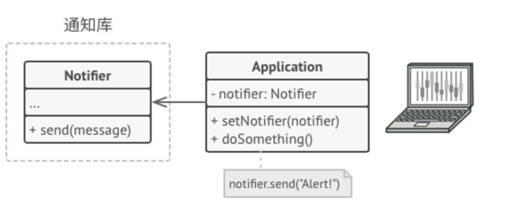
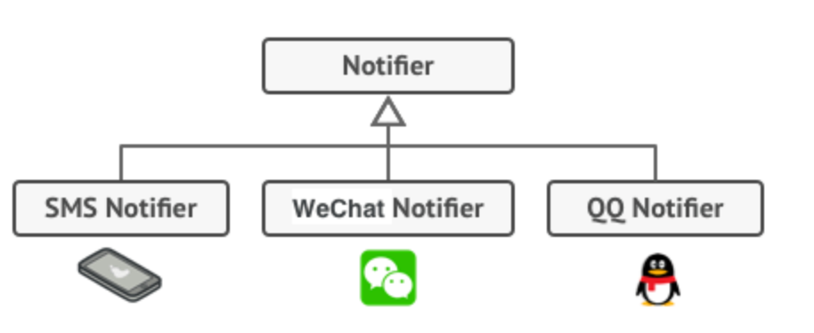
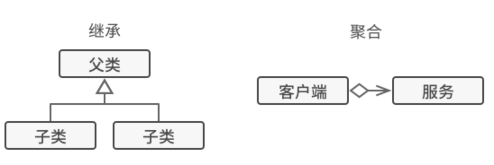
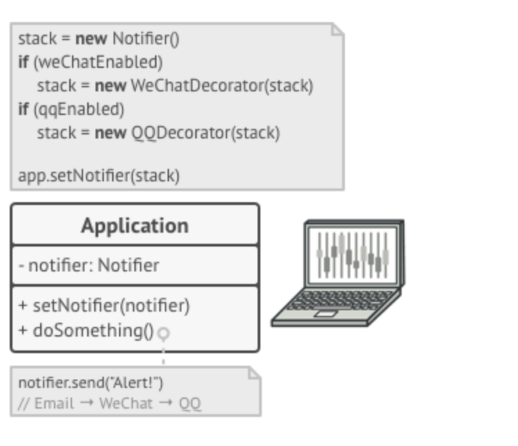
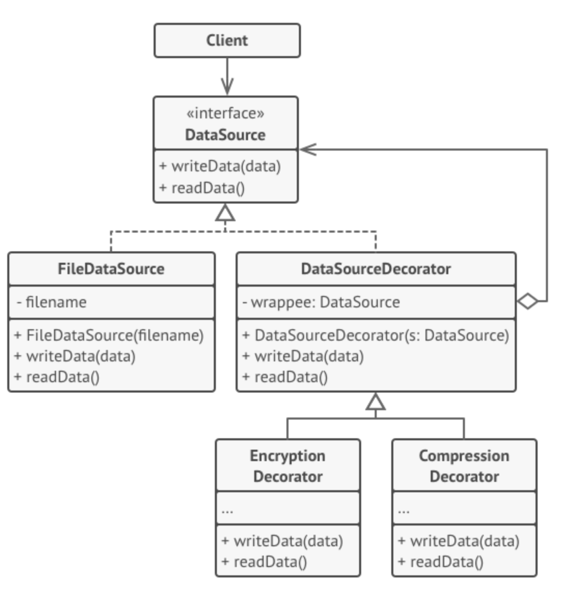

亦称： 装饰者模式、 装饰器模式、 Wrapper、 Decorator

意图
--

**装饰模式**是一种结构型设计模式， 允许你通过将对象放入包含行为的特殊封装对象中来为原对象绑定新的行为。


问题
--

假设你正在开发一个提供通知功能的库， 其他程序可使用它向用户发送关于重要事件的通知。

库的最初版本基于 `通知器`Notifier 类， 其中只有很少的几个成员变量， 一个构造函数和一个 `send`发送方法。 该方法可以接收来自客户端的消息参数， 并将该消息发送给一系列的邮箱， 邮箱列表则是通过构造函数传递给通知器的。 作为客户端的第三方程序仅会创建和配置通知器对象一次， 然后在有重要事件发生时对其进行调用。



程序可以使用通知器类向预定义的邮箱发送重要事件通知。

此后某个时刻， 你会发现库的用户希望使用除邮件通知之外的功能。 许多用户会希望接收关于紧急事件的手机短信， 还有些用户希望在微信上接收消息， 而公司用户则希望在 QQ 上接收消息。



每种通知类型都将作为通知器的一个子类得以实现。

这有什么难的呢？ 首先扩展 `通知器`类， 然后在新的子类中加入额外的通知方法。 现在客户端要对所需通知形式的对应类进行初始化， 然后使用该类发送后续所有的通知消息。

但是很快有人会问： ​ “为什么不同时使用多种通知形式呢？ 如果房子着火了， 你大概会想在所有渠道中都收到相同的消息吧。”

你可以尝试创建一个特殊子类来将多种通知方法组合在一起以解决该问题。 但这种方式会使得代码量迅速膨胀， 不仅仅是程序库代码， 客户端代码也会如此。


子类组合数量爆炸。

你必须找到其他方法来规划通知类的结构， 否则它们的数量会在不经意之间打破吉尼斯纪录。

解决方案
----

当你需要更改一个对象的行为时， 第一个跳入脑海的想法就是扩展它所属的类。 但是， 你不能忽视继承可能引发的几个严重问题。

*   继承是静态的。 你无法在运行时更改已有对象的行为， 只能使用由不同子类创建的对象来替代当前的整个对象。
    
*   子类只能有一个父类。 大部分编程语言不允许一个类同时继承多个类的行为。
    

其中一种方法是用_聚合_或_组合_ ， 而不是_继承_。 两者的工作方式几乎一模一样： 一个对象_包含_指向另一个对象的引用， 并将部分工作委派给引用对象； 继承中的对象则继承了父类的行为， 它们自己_能够_完成这些工作。

你可以使用这个新方法来轻松替换各种连接的 “小帮手” 对象， 从而能在运行时改变容器的行为。 一个对象可以使用多个类的行为， 包含多个指向其他对象的引用， 并将各种工作委派给引用对象。

聚合 （或组合） 是许多设计模式背后的关键原则 （包括装饰在内）。 记住这一点后， 让我们继续关于模式的讨论。



继承与组合的对比

_封装器_是装饰模式的别称， 这个称谓明确地表达了该模式的主要思想。 ​ “封装器” 是一个能与其他 “目标” 对象连接的对象。 封装器包含与目标对象相同的一系列方法， 它会将所有接收到的请求委派给目标对象。 但是， 封装器可以在将请求委派给目标前后对其进行处理， 所以可能会改变最终结果。

那么什么时候一个简单的封装器可以被称为是真正的装饰呢？ 正如之前提到的， 封装器实现了与其封装对象相同的接口。 因此从客户端的角度来看， 这些对象是完全一样的。 封装器中的引用成员变量可以是遵循相同接口的任意对象。 这使得你可以将一个对象放入多个封装器中， 并在对象中添加所有这些封装器的组合行为。

比如在消息通知示例中， 我们可以将简单邮件通知行为放在基类 `通知器`中， 但将所有其他通知方法放入装饰中。


将各种通知方法放入装饰。

客户端代码必须将基础通知器放入一系列自己所需的装饰中。 因此最后的对象将形成一个栈结构。



程序可以配置由通知装饰构成的复杂栈。

实际与客户端进行交互的对象将是最后一个进入栈中的装饰对象。 由于所有的装饰都实现了与通知基类相同的接口， 客户端的其他代码并不在意自己到底是与 “纯粹” 的通知器对象， 还是与装饰后的通知器对象进行交互。

我们可以使用相同方法来完成其他行为 （例如设置消息格式或者创建接收人列表）。 只要所有装饰都遵循相同的接口， 客户端就可以使用任意自定义的装饰来装饰对象。

真实世界类比
------


穿上多件衣服将获得组合性的效果。

穿衣服是使用装饰的一个例子。 觉得冷时， 你可以穿一件毛衣。 如果穿毛衣还觉得冷， 你可以再套上一件夹克。 如果遇到下雨， 你还可以再穿一件雨衣。 所有这些衣物都 “扩展” 了你的基本行为， 但它们并不是你的一部分， 如果你不再需要某件衣物， 可以方便地随时脱掉。

装饰模式结构
------

1.  **部件** （Component） 声明封装器和被封装对象的公用接口。
    
2.  **具体部件** （Concrete Component） 类是被封装对象所属的类。 它定义了基础行为， 但装饰类可以改变这些行为。
    
3.  **基础装饰** （Base Decorator） 类拥有一个指向被封装对象的引用成员变量。 该变量的类型应当被声明为通用部件接口， 这样它就可以引用具体的部件和装饰。 装饰基类会将所有操作委派给被封装的对象。
    
4.  **具体装饰类** （Concrete Decorators） 定义了可动态添加到部件的额外行为。 具体装饰类会重写装饰基类的方法， 并在调用父类方法之前或之后进行额外的行为。
    
5.  **客户端** （Client） 可以使用多层装饰来封装部件， 只要它能使用通用接口与所有对象互动即可。
    

伪代码
---

在本例中， ** 装饰 * 模式能够对敏感数据进行压缩和加密， 从而将数据从使用数据的代码中独立出来。



加密和压缩装饰的示例。

程序使用一对装饰来封装数据源对象。 这两个封装器都改变了从磁盘读写数据的方式：

*   当数据即将被**写入磁盘**前， 装饰对数据进行加密和压缩。 在原始类对改变毫无察觉的情况下， 将加密后的受保护数据写入文件。
    
*   当数据刚**从磁盘读出**后， 同样通过装饰对数据进行解压和解密。 装饰和数据源类实现同一接口， 从而能在客户端代码中相互替换。
    

```
// 装饰可以改变组件接口所定义的操作。
interface DataSource is
    method writeData(data)
    method readData():data

// 具体组件提供操作的默认实现。这些类在程序中可能会有几个变体。
class FileDataSource implements DataSource is
    constructor FileDataSource(filename) { ... }

    method writeData(data) is
        // 将数据写入文件。

    method readData():data is
        // 从文件读取数据。

// 装饰基类和其他组件遵循相同的接口。该类的主要任务是定义所有具体装饰的封
// 装接口。封装的默认实现代码中可能会包含一个保存被封装组件的成员变量，并
// 且负责对其进行初始化。
class DataSourceDecorator implements DataSource is
    protected field wrappee: DataSource

    constructor DataSourceDecorator(source: DataSource) is
        wrappee = source

    // 装饰基类会直接将所有工作分派给被封装组件。具体装饰中则可以新增一些
    // 额外的行为。
    method writeData(data) is
        wrappee.writeData(data)

    // 具体装饰可调用其父类的操作实现，而不是直接调用被封装对象。这种方式
    // 可简化装饰类的扩展工作。
    method readData():data is
        return wrappee.readData()

// 具体装饰必须在被封装对象上调用方法，不过也可以自行在结果中添加一些内容。
// 装饰必须在调用封装对象之前或之后执行额外的行为。
class EncryptionDecorator extends DataSourceDecorator is
    method writeData(data) is
        // 1. 对传递数据进行加密。
        // 2. 将加密后数据传递给被封装对象 writeData（写入数据）方法。

    method readData():data is
        // 1. 通过被封装对象的 readData（读取数据）方法获取数据。
        // 2. 如果数据被加密就尝试解密。
        // 3. 返回结果。

// 你可以将对象封装在多层装饰中。
class CompressionDecorator extends DataSourceDecorator is
    method writeData(data) is
        // 1. 压缩传递数据。
        // 2. 将压缩后数据传递给被封装对象 writeData（写入数据）方法。

    method readData():data is
        // 1. 通过被封装对象的 readData（读取数据）方法获取数据。
        // 2. 如果数据被压缩就尝试解压。
        // 3. 返回结果。


// 选项 1：装饰组件的简单示例
class Application is
    method dumbUsageExample() is
        source = new FileDataSource("somefile.dat")
        source.writeData(salaryRecords)
        // 已将明码数据写入目标文件。

        source = new CompressionDecorator(source)
        source.writeData(salaryRecords)
        // 已将压缩数据写入目标文件。

        source = new EncryptionDecorator(source)
        // 源变量中现在包含：
        // Encryption > Compression > FileDataSource
        source.writeData(salaryRecords)
        // 已将压缩且加密的数据写入目标文件。


// 选项 2：客户端使用外部数据源。SalaryManager（工资管理器）对象并不关心
// 数据如何存储。它们会与提前配置好的数据源进行交互，数据源则是通过程序配
// 置器获取的。
class SalaryManager is
    field source: DataSource

    constructor SalaryManager(source: DataSource) { ... }

    method load() is
        return source.readData()

    method save() is
        source.writeData(salaryRecords)
    // ...其他有用的方法...


// 程序可在运行时根据配置或环境组装不同的装饰堆桟。
class ApplicationConfigurator is
    method configurationExample() is
        source = new FileDataSource("salary.dat")
        if (enabledEncryption)
            source = new EncryptionDecorator(source)
        if (enabledCompression)
            source = new CompressionDecorator(source)

        logger = new SalaryManager(source)
        salary = logger.load()
    


```

装饰模式适用性
-------

如果你希望在无需修改代码的情况下即可使用对象， 且希望在运行时为对象新增额外的行为， 可以使用装饰模式。

装饰能将业务逻辑组织为层次结构， 你可为各层创建一个装饰， 在运行时将各种不同逻辑组合成对象。 由于这些对象都遵循通用接口， 客户端代码能以相同的方式使用这些对象。

如果用继承来扩展对象行为的方案难以实现或者根本不可行， 你可以使用该模式。

许多编程语言使用 `final`最终关键字来限制对某个类的进一步扩展。 复用最终类已有行为的唯一方法是使用装饰模式： 用封装器对其进行封装。

实现方式
----

1.  确保业务逻辑可用一个基本组件及多个额外可选层次表示。
    
2.  找出基本组件和可选层次的通用方法。 创建一个组件接口并在其中声明这些方法。
    
3.  创建一个具体组件类， 并定义其基础行为。
    
4.  创建装饰基类， 使用一个成员变量存储指向被封装对象的引用。 该成员变量必须被声明为组件接口类型， 从而能在运行时连接具体组件和装饰。 装饰基类必须将所有工作委派给被封装的对象。
    
5.  确保所有类实现组件接口。
    
6.  将装饰基类扩展为具体装饰。 具体装饰必须在调用父类方法 （总是委派给被封装对象） 之前或之后执行自身的行为。
    
7.  客户端代码负责创建装饰并将其组合成客户端所需的形式。
    

装饰模式优缺点
-------

*   你无需创建新子类即可扩展对象的行为。
*   你可以在运行时添加或删除对象的功能。
*   你可以用多个装饰封装对象来组合几种行为。
*   [单一职责原则](https://refactoringguru.cn/didp/principles/solid-principles/srp)。 你可以将实现了许多不同行为的一个大类拆分为多个较小的类。

*   在封装器栈中删除特定封装器比较困难。
*   实现行为不受装饰栈顺序影响的装饰比较困难。
*   各层的初始化配置代码看上去可能会很糟糕。

与其他模式的关系
--------

*   [适配器模式](https://refactoringguru.cn/design-patterns/adapter)可以对已有对象的接口进行修改， [装饰模式](https://refactoringguru.cn/design-patterns/decorator)则能在不改变对象接口的前提下强化对象功能。 此外， _装饰_还支持递归组合， _适配器_则无法实现。
    
*   [适配器](https://refactoringguru.cn/design-patterns/adapter)能为被封装对象提供不同的接口， [代理模式](https://refactoringguru.cn/design-patterns/proxy)能为对象提供相同的接口， [装饰](https://refactoringguru.cn/design-patterns/decorator)则能为对象提供加强的接口。
    
*   [责任链模式](https://refactoringguru.cn/design-patterns/chain-of-responsibility)和[装饰模式](https://refactoringguru.cn/design-patterns/decorator)的类结构非常相似。 两者都依赖递归组合将需要执行的操作传递给一系列对象。 但是， 两者有几点重要的不同之处。
    
    [责任链](https://refactoringguru.cn/design-patterns/chain-of-responsibility)的管理者可以相互独立地执行一切操作， 还可以随时停止传递请求。 另一方面， 各种_装饰_可以在遵循基本接口的情况下扩展对象的行为。 此外， 装饰无法中断请求的传递。
    
*   [组合模式](https://refactoringguru.cn/design-patterns/composite)和[装饰](https://refactoringguru.cn/design-patterns/decorator)的结构图很相似， 因为两者都依赖递归组合来组织无限数量的对象。
    
    _装饰_类似于_组合_， 但其只有一个子组件。 此外还有一个明显不同： _装饰_为被封装对象添加了额外的职责， _组合_仅对其子节点的结果进行了 “求和”。
    
    但是， 模式也可以相互合作： 你可以使用_装饰_来扩展_组合_树中特定对象的行为。
    
*   大量使用[组合](https://refactoringguru.cn/design-patterns/composite)和[装饰](https://refactoringguru.cn/design-patterns/decorator)的设计通常可从对于[原型模式](https://refactoringguru.cn/design-patterns/prototype)的使用中获益。 你可以通过该模式来复制复杂结构， 而非从零开始重新构造。
    
*   [装饰](https://refactoringguru.cn/design-patterns/decorator)可让你更改对象的外表， [策略模式](https://refactoringguru.cn/design-patterns/strategy)则让你能够改变其本质。
    
*   [装饰](https://refactoringguru.cn/design-patterns/decorator)和[代理](https://refactoringguru.cn/design-patterns/proxy)有着相似的结构， 但是其意图却非常不同。 这两个模式的构建都基于组合原则， 也就是说一个对象应该将部分工作委派给另一个对象。 两者之间的不同之处在于**代理通常自行管理其服务对象的生命周期， 而_装饰_的生成则总是由客户端进行控制**。

Typescript实现
-----

装饰在 TypeScript 代码中可谓是标准配置， 尤其是在与流式加载相关的代码中

``` javascript
// 装饰可以改变组件接口所定义的操作。
interface Component {
  operation(): string;
}

// 具体组件提供操作的默认实现。这些类在程序中可能会有几个变体。
class ConcreteComponent implements Component {
  public operation(): string {
    return "ConcreteComponent";
  }
}

// 装饰基类和其他组件遵循相同的接口。该类的主要任务是定义所有具体装饰的封
// 装接口。封装的默认实现代码中可能会包含一个保存被封装组件的成员变量，并
// 且负责对其进行初始化。
class Decorator implements Component {
  protected component: Component;

  constructor(component: Component) {
    this.component = component;
  }

  // 装饰基类会直接将所有工作分派给被封装组件。具体装饰中则可以新增一些
  // 额外的行为。
  public operation(): string {
    return this.component.operation();
  }
}

// 具体装饰必须在被封装对象上调用方法，不过也可以自行在结果中添加一些内容。
// 装饰必须在调用封装对象之前或之后执行额外的行为。
class ConcreteDecoratorA extends Decorator {
  /**
   * Decorators may call parent implementation of the operation, instead of
   * calling the wrapped object directly. This approach simplifies extension
   * of decorator classes.
   */
  public operation(): string {
    return `ConcreteDecoratorA(${super.operation()})`;
  }
}

/**
 * Decorators can execute their behavior either before or after the call to a
 * wrapped object.
 */
class ConcreteDecoratorB extends Decorator {
  public operation(): string {
    return `ConcreteDecoratorB(${super.operation()})`;
  }
}

/**
 * The client code works with all objects using the Component interface. This
 * way it can stay independent of the concrete classes of components it works
 * with.
 */
function clientDecorator(component: Component) {
  // ...

  console.log(`RESULT: ${component.operation()}`);

  // ...
}

/**
 * This way the client code can support both simple components...
 */
const simple = new ConcreteComponent();
console.log("Client: I've got a simple component:");
clientDecorator(simple);
console.log("");

/**
 * ...as well as decorated ones.
 *
 * Note how decorators can wrap not only simple components but the other
 * decorators as well.
 */
const decorator1 = new ConcreteDecoratorA(simple);
const decorator2 = new ConcreteDecoratorB(decorator1);
console.log("Client: Now I've got a decorated component:");
clientDecorator(decorator2);

// Client: I've got a simple component:
// RESULT: ConcreteComponent

// Client: Now I've got a decorated component:
// RESULT: ConcreteDecoratorB(ConcreteDecoratorA(ConcreteComponent))

```


Javascript简易实现
-----

``` javascript
class Pasta {
  constructor() {
    this.price = 0;
  }
  getPrice() {
    return this.price;
  }
}

class Penne extends Pasta {
  constructor() {
    super();
    this.price = 8;
  }
}

class PastaDecorator extends Pasta {
  constructor(pasta) {
    super();
    this.pasta = pasta;
  }

  getPrice() {
    return this.pasta.getPrice();
  }
}

class SauceDecorator extends PastaDecorator {
  constructor(pasta) {
    super(pasta);
  }

  getPrice() {
    return super.getPrice() + 5;
  }
}

class CheeseDecorator extends PastaDecorator {
  constructor(pasta) {
    super(pasta);
  }

  getPrice() {
    return super.getPrice() + 3;
  }
}

export { Penne, SauceDecorator, CheeseDecorator };

```

应用场景
------

1、前端装饰器应用场景

Angular/Nest/Mobx 目前均有装饰器提供的基础用法。

至于如何实现装饰器，可以参考[Javascript | 无所不能的前端--十万个为什么](https://omnipotent-front-end.github.io/language/javascript.html#%E5%A6%82%E4%BD%95%E5%AE%9E%E7%8E%B0-decorator)


