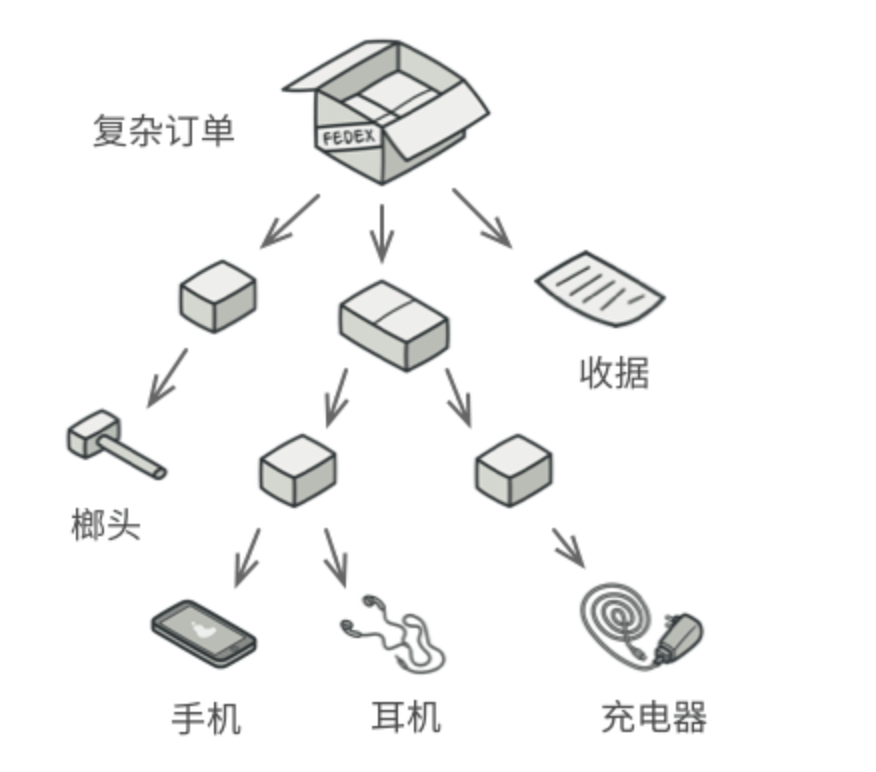
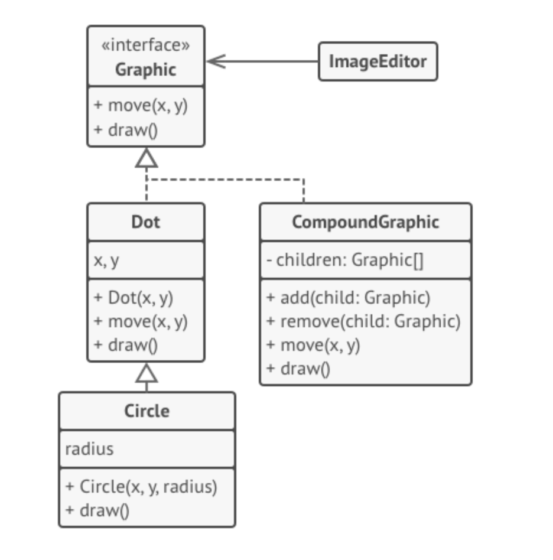

亦称： 对象树、 Object Tree、 Composite

意图
--

**组合模式**是一种结构型设计模式， 你可以使用它将对象组合成树状结构， 并且能像使用独立对象一样使用它们。


问题
--

如果应用的核心模型能用树状结构表示， 在应用中使用组合模式才有价值。

例如， 你有两类对象： ​ `产品`和 `盒子` 。 一个盒子中可以包含多个 `产品`或者几个较小的 `盒子` 。 这些小 `盒子`中同样可以包含一些 `产品`或更小的 `盒子` ， 以此类推。

假设你希望在这些类的基础上开发一个定购系统。 订单中可以包含无包装的简单产品， 也可以包含装满产品的盒子…… 以及其他盒子。 此时你会如何计算每张订单的总价格呢？



订单中可能包括各种产品， 这些产品放置在盒子中， 然后又被放入一层又一层更大的盒子中。 整个结构看上去像是一棵倒过来的树。

你可以尝试直接计算： 打开所有盒子， 找到每件产品， 然后计算总价。 这在真实世界中或许可行， 但在程序中， 你并不能简单地使用循环语句来完成该工作。 你必须事先知道所有 `产品`和 `盒子`的类别， 所有盒子的嵌套层数以及其他繁杂的细节信息。 因此， 直接计算极不方便， 甚至完全不可行。

解决方案
----

组合模式建议使用一个通用接口来与 `产品`和 `盒子`进行交互， 并且在该接口中声明一个计算总价的方法。

那么方法该如何设计呢？ 对于一个产品， 该方法直接返回其价格； 对于一个盒子， 该方法遍历盒子中的所有项目， 询问每个项目的价格， 然后返回该盒子的总价格。 如果其中某个项目是小一号的盒子， 那么当前盒子也会遍历其中的所有项目， 以此类推， 直到计算出所有内部组成部分的价格。 你甚至可以在盒子的最终价格中增加额外费用， 作为该盒子的包装费用。


组合模式以递归方式处理对象树中的所有项目

该方式的最大优点在于你无需了解构成树状结构的对象的具体类。 你也无需了解对象是简单的产品还是复杂的盒子。 你只需调用通用接口以相同的方式对其进行处理即可。 当你调用该方法后， 对象会将请求沿着树结构传递下去。

真实世界类比
------


部队结构的例子。

大部分国家的军队都采用层次结构管理。 每支部队包括几个师， 师由旅构成， 旅由团构成， 团可以继续划分为排。 最后， 每个排由一小队实实在在的士兵组成。 军事命令由最高层下达， 通过每个层级传递， 直到每位士兵都知道自己应该服从的命令。

组合模式结构
------

1.  **组件** （Component） 接口描述了树中简单项目和复杂项目所共有的操作。
    
2.  **叶节点** （Leaf） 是树的基本结构， 它不包含子项目。
    
    一般情况下， 叶节点最终会完成大部分的实际工作， 因为它们无法将工作指派给其他部分。
    
3.  **容器** （Container）——又名 “组合 （Composite）”——是包含叶节点或其他容器等子项目的单位。 容器不知道其子项目所属的具体类， 它只通过通用的组件接口与其子项目交互。
    
    容器接收到请求后会将工作分配给自己的子项目， 处理中间结果， 然后将最终结果返回给客户端。
    
4.  **客户端** （Client） 通过组件接口与所有项目交互。 因此， 客户端能以相同方式与树状结构中的简单或复杂项目交互。
    

伪代码
---

在本例中， 我们将借助**组合**模式帮助你在图形编辑器中实现一系列的几何图形。



几何形状编辑器示例。

`组合图形`Compound­Graphic 是一个容器， 它可以由多个包括容器在内的子图形构成。 组合图形与简单图形拥有相同的方法。 但是， 组合图形自身并不完成具体工作， 而是将请求递归地传递给自己的子项目， 然后 “汇总” 结果。

通过所有图形类所共有的接口， 客户端代码可以与所有图形互动。 因此， 客户端不知道与其交互的是简单图形还是组合图形。 客户端可以与非常复杂的对象结构进行交互， 而无需与组成该结构的实体类紧密耦合。

```
// 组件接口会声明组合中简单和复杂对象的通用操作。
interface Graphic is
    method move(x, y)
    method draw()

// 叶节点类代表组合的终端对象。叶节点对象中不能包含任何子对象。叶节点对象
// 通常会完成实际的工作，组合对象则仅会将工作委派给自己的子部件。
class Dot implements Graphic is
    field x, y

    constructor Dot(x, y) { ... }

    method move(x, y) is
        this.x += x, this.y += y

    method draw() is
        // 在坐标位置(X,Y)处绘制一个点。

// 所有组件类都可以扩展其他组件。
class Circle extends Dot is
    field radius

    constructor Circle(x, y, radius) { ... }

    method draw() is
        // 在坐标位置(X,Y)处绘制一个半径为 R 的圆。

// 组合类表示可能包含子项目的复杂组件。组合对象通常会将实际工作委派给子项
// 目，然后“汇总”结果。
class CompoundGraphic implements Graphic is
    field children: array of Graphic

    // 组合对象可在其项目列表中添加或移除其他组件（简单的或复杂的皆可）。
    method add(child: Graphic) is
        // 在子项目数组中添加一个子项目。

    method remove(child: Graphic) is
        // 从子项目数组中移除一个子项目。

    method move(x, y) is
        foreach (child in children) do
            child.move(x, y)

    // 组合会以特定的方式执行其主要逻辑。它会递归遍历所有子项目，并收集和
    // 汇总其结果。由于组合的子项目也会将调用传递给自己的子项目，以此类推，
    // 最后组合将会完成整个对象树的遍历工作。
    method draw() is
        // 1. 对于每个子部件：
        //     - 绘制该部件。
        //     - 更新边框坐标。
        // 2. 根据边框坐标绘制一个虚线长方形。


// 客户端代码会通过基础接口与所有组件进行交互。这样一来，客户端代码便可同
// 时支持简单叶节点组件和复杂组件。
class ImageEditor is
    field all: array of Graphic

    method load() is
        all = new CompoundGraphic()
        all.add(new Dot(1, 2))
        all.add(new Circle(5, 3, 10))
        

    // 将所需组件组合为复杂的组合组件。
    method groupSelected(components: array of Graphic) is
        group = new CompoundGraphic()
        foreach (component in components) do
            group.add(component)
            all.remove(component)
        all.add(group)
        // 所有组件都将被绘制。
        all.draw()


```

组合模式适用性
-------

如果你需要实现树状对象结构， 可以使用组合模式。

组合模式为你提供了两种共享公共接口的基本元素类型： 简单叶节点和复杂容器。 容器中可以包含叶节点和其他容器。 这使得你可以构建树状嵌套递归对象结构。

如果你希望客户端代码以相同方式处理简单和复杂元素， 可以使用该模式。

组合模式中定义的所有元素共用同一个接口。 在这一接口的帮助下， 客户端不必在意其所使用的对象的具体类。

实现方式
----

1.  确保应用的核心模型能够以树状结构表示。 尝试将其分解为简单元素和容器。 记住， 容器必须能够同时包含简单元素和其他容器。
    
2.  声明组件接口及其一系列方法， 这些方法对简单和复杂元素都有意义。
    
3.  创建一个叶节点类表示简单元素。 程序中可以有多个不同的叶节点类。
    
4.  创建一个容器类表示复杂元素。 在该类中， 创建一个数组成员变量来存储对于其子元素的引用。 该数组必须能够同时保存叶节点和容器， 因此请确保将其声明为组合接口类型。
    
    实现组件接口方法时， 记住容器应该将大部分工作交给其子元素来完成。
    
5.  最后， 在容器中定义添加和删除子元素的方法。
    
    记住， 这些操作可在组件接口中声明。 这将会违反[接口隔离原则](https://refactoringguru.cn/didp/principles/solid-principles/isp)， 因为叶节点类中的这些方法为空。 但是， 这可以让客户端无差别地访问所有元素， 即使是组成树状结构的元素。
    

组合模式优缺点
-------

*   你可以利用多态和递归机制更方便地使用复杂树结构。
*   [开闭原则](https://refactoringguru.cn/didp/principles/solid-principles/ocp)。 无需更改现有代码， 你就可以在应用中添加新元素， 使其成为对象树的一部分。

*   对于功能差异较大的类， 提供公共接口或许会有困难。 在特定情况下， 你需要过度一般化组件接口， 使其变得令人难以理解。

与其他模式的关系
--------

*   [桥接模式](../bridge/index.md)、 [状态模式](../state/index.md)和[策略模式](../strategy/index.md) （在某种程度上包括[适配器模式]../adapter/index.md)） 模式的接口非常相似。 实际上， 它们都基于组合模式——即将工作委派给其他对象， 不过也各自解决了不同的问题。 模式并不只是以特定方式组织代码的配方， 你还可以使用它们来和其他开发者讨论模式所解决的问题。
    
*   你可以在创建复杂组合树时使用[生成器模式](../builder/index.md)， 因为这可使其构造步骤以递归的方式运行。
    
*   [责任链模式](../chain/index.md)通常和组合模式结合使用。 在这种情况下， 叶组件接收到请求后， 可以将请求沿包含全体父组件的链一直传递至对象树的底部。
    
*   你可以使用[迭代器模式](../iterator/index.md)来遍历组合树。
    
*   你可以使用[访问者模式](../visitor/index.md)对整个组合树执行操作。
    
*   你可以使用[享元模式](../flyweight/index.md)实现组合树的共享叶节点以节省内存。
    
*   组合和[装饰模式](../decorator/index.md)的结构图很相似， 因为两者都依赖递归组合来组织无限数量的对象。
    
    _装饰_类似于_组合_， 但其只有一个子组件。 此外还有一个明显不同： _装饰_为被封装对象添加了额外的职责， _组合_仅对其子节点的结果进行了 “求和”。
    
    但是， 模式也可以相互合作： 你可以使用_装饰_来扩展_组合_树中特定对象的行为。
    
*   大量使用组合和[装饰](../decorator/index.md)的设计通常可从对于[原型模式](../prototype/index.md)的使用中获益。 你可以通过该模式来复制复杂结构， 而非从零开始重新构造。

Typescript实现
-----

组合模式在 TypeScript 代码中很常见， 常用于表示与图形打交道的用户界面组件或代码的层次结构。

[代码参考](/code/composite/index.ts)


Javascript简易实现
-----

[代码参考](/code/composite/index.js)


应用场景
-------

1、文件系统

文件夹和文件之间的关系，非常适合用组合模式来描述。文件夹里既可以包含文件，又可以包含其他文件夹，最终可能组合成一棵树。

前端基于组件框架vue，完成树状组件。可以参考[elementui中el-tree的实现](https://github.com/FunnyLiu/element/blob/readsource/packages/tree/src/tree.vue)

