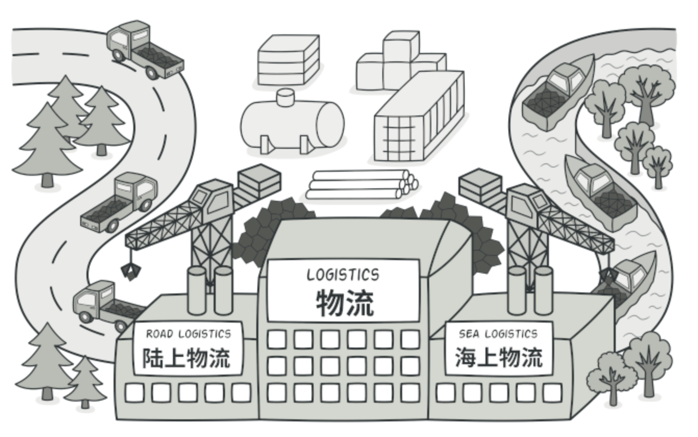
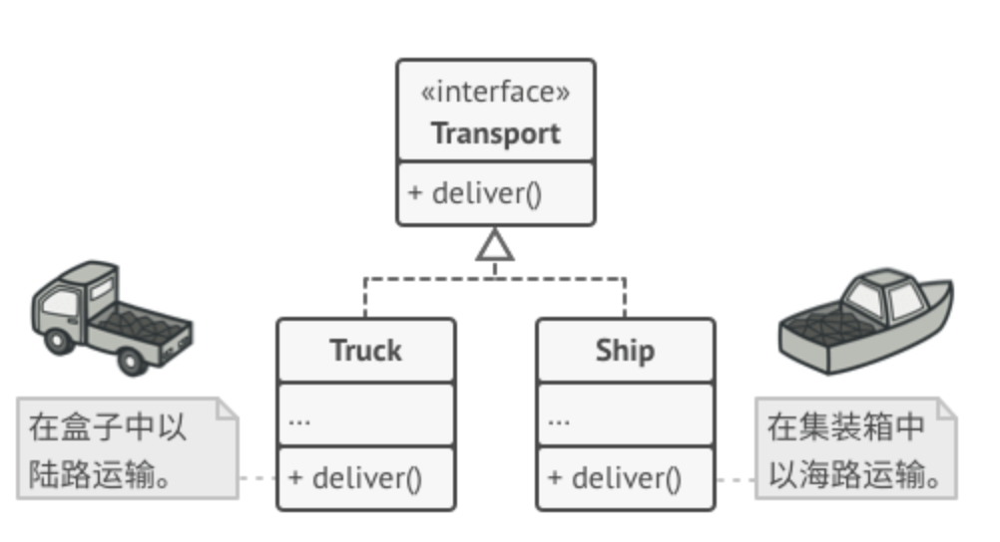

亦称： 虚拟构造函数、 Virtual Constructor、 Factory Method

意图
--

**工厂方法模式**是一种创建型设计模式， 其**在父类中提供一个创建对象的接口， 允许子类决定实例化对象的类型**。




问题
--

假设你正在开发一款物流管理应用。 最初版本只能处理卡车运输， 因此大部分代码都在位于名为 `卡车`的类中。

一段时间后， 这款应用变得极受欢迎。 你每天都能收到十几次来自海运公司的请求， 希望应用能够支持海上物流功能。


如果代码其余部分与现有类已经存在耦合关系， 那么向程序中添加新类其实并没有那么容易。

这可是个好消息。 但是代码问题该如何处理呢？ 目前， 大部分代码都与 `卡车`类相关。 在程序中添加 `轮船`类需要修改全部代码。 更糟糕的是， 如果你以后需要在程序中支持另外一种运输方式， 很可能需要再次对这些代码进行大幅修改。

最后， 你将不得不编写繁复的代码， 根据不同的运输对象类， 在应用中进行不同的处理。

解决方案
----

工厂方法模式建议**使用特殊的工厂方法代替对于对象构造函数的直接调用** （即使用 `new`运算符）。 不用担心， 对象仍将通过 `new`运算符创建， 只是**该运算符改在工厂方法中调用罢了**。 工厂方法返回的对象通常被称作 “产品”。


子类可以修改工厂方法返回的对象类型。

乍看之下， 这种更改可能毫无意义： 我们只是改变了程序中调用构造函数的位置而已。 但是， 仔细想一下， 现在你**可以在子类中重写工厂方法， 从而改变其创建产品的类型**。

但有一点需要注意: 仅当这些产品具有共同的基类或者接口时， 子类才能返回不同类型的产品， 同时基类中的工厂方法还应将其返回类型声明为这一共有接口。



所有产品都必须使用同一接口。

举例来说， ​ `卡车`Truck 和 `轮船`Ship 类都必须实现 `运输`Transport 接口， 该接口声明了一个名为 `deliver`交付的方法。 每个类都将以不同的方式实现该方法： 卡车走陆路交付货物， 轮船走海路交付货物。 ​ `陆路运输`Road­Logistics 类中的工厂方法返回卡车对象， 而 `海路运输`Sea­Logistics 类则返回轮船对象。


只要产品类实现一个共同的接口， 你就可以将其对象传递给客户代码， 而无需提供额外数据。

调用工厂方法的代码 （通常被称为_客户端_代码） **无需了解不同子类返回实际对象之间的差别**。 客户端将所有产品视为抽象的 `运输` 。 客户端知道所有运输对象都提供 `交付`方法， 但是并**不关心其具体实现方式**。

工厂方法模式结构
--------

1.  **产品** （Product） 将会对接口进行声明。 对于所有由创建者及其子类构建的对象， 这些接口都是通用的。
    
2.  **具体产品** （Concrete Products） 是产品接口的不同实现。
    
3.  **创建者** （Creator） 类声明**返回产品对象的工厂方法**。 该方法的返回对象类型必须与产品接口相匹配。
    
    你可以将工厂方法声明为抽象方法， 强制要求每个子类以不同方式实现该方法。 或者， 你也可以在基础工厂方法中返回默认产品类型。
    
    注意， 尽管它的名字是创建者， 但他最主要的职责并**不是**创建产品。 一般来说， 创建者类包含一些与产品相关的核心业务逻辑。 工厂方法将这些逻辑处理从具体产品类中分离出来。 打个比方， 大型软件开发公司拥有程序员培训部门。 但是， 这些公司的主要工作还是编写代码， 而非生产程序员。
    
4.  **具体创建者** （Concrete Creators） 将会重写基础工厂方法， 使其返回不同类型的产品。
    
    注意， 并不一定每次调用工厂方法都会**创建**新的实例。 工厂方法也可以返回缓存、 对象池或其他来源的已有对象。
    

伪代码
---

以下示例演示了如何使用**工厂方法**开发跨平台 UI （用户界面） 组件， 并同时避免客户代码与具体 UI 类之间的耦合。


跨平台对话框示例。

基础对话框类使用不同的 UI 组件渲染窗口。 在不同的操作系统下， 这些组件外观或许略有不同， 但其功能保持一致。 Windows 系统中的按钮在 Linux 系统中仍然是按钮。

如果使用工厂方法， 就不需要为每种操作系统重写对话框逻辑。 如果我们声明了一个在基本对话框类中生成按钮的工厂方法， 那么我们就可以创建一个对话框子类， 并使其通过工厂方法返回 Windows 样式按钮。 子类将继承对话框基础类的大部分代码， 同时在屏幕上根据 Windows 样式渲染按钮。

如需该模式正常工作， 基础对话框类必须使用抽象按钮 （例如基类或接口）， 以便将其扩展为具体按钮。 这样一来， 无论对话框中使用何种类型的按钮， 其代码都可以正常工作。

你可以使用此方法开发其他 UI 组件。 不过， **每向对话框中添加一个新的工厂方法， 你就离抽象工厂模式更近一步**。 我们将在稍后谈到这个模式。

```
// 创建者类声明的工厂方法必须返回一个产品类的对象。创建者的子类通常会提供
// 该方法的实现。
class Dialog is
    // 创建者还可提供一些工厂方法的默认实现。
    abstract method createButton():Button

    // 请注意，创建者的主要职责并非是创建产品。其中通常会包含一些核心业务
    // 逻辑，这些逻辑依赖于由工厂方法返回的产品对象。子类可通过重写工厂方
    // 法并使其返回不同类型的产品来间接修改业务逻辑。
    method render() is
        // 调用工厂方法创建一个产品对象。
        Button okButton = createButton()
        // 现在使用产品。
        okButton.onClick(closeDialog)
        okButton.render()


// 具体创建者将重写工厂方法以改变其所返回的产品类型。
class WindowsDialog extends Dialog is
    method createButton():Button is
        return new WindowsButton()

class WebDialog extends Dialog is
    method createButton():Button is
        return new HTMLButton()


// 产品接口中将声明所有具体产品都必须实现的操作。
interface Button is
    method render()
    method onClick(f)

// 具体产品需提供产品接口的各种实现。
class WindowsButton implements Button is
    method render(a, b) is
        // 根据 Windows 样式渲染按钮。
    method onClick(f) is
        // 绑定本地操作系统点击事件。

class HTMLButton implements Button is
    method render(a, b) is
        // 返回一个按钮的 HTML 表述。
    method onClick(f) is
        // 绑定网络浏览器的点击事件。


class Application is
    field dialog: Dialog

    // 程序根据当前配置或环境设定选择创建者的类型。
    method initialize() is
        config = readApplicationConfigFile()

        if (config.OS == "Windows") then
            dialog = new WindowsDialog()
        else if (config.OS == "Web") then
            dialog = new WebDialog()
        else
            throw new Exception("错误！未知的操作系统。")

    // 当前客户端代码会与具体创建者的实例进行交互，但是必须通过其基本接口
    // 进行。只要客户端通过基本接口与创建者进行交互，你就可将任何创建者子
    // 类传递给客户端。
    method main() is
        this.initialize()
        dialog.render()


```

工厂方法模式适用性
---------

当你在编写代码的过程中， 如果**无法预知对象确切类别及其依赖关系时， 可使用工厂方法**。

工厂方法将创建产品的代码与实际使用产品的代码分离， 从而能在**不影响其他代码的情况下扩展产品创建部分代码**。

例如， 如果需要向应用中添加一种新产品， 你只需要开发新的创建者子类， 然后重写其工厂方法即可。

如果你**希望用户能扩展你软件库或框架的内部组件， 可使用工厂方法**。

继承可能是扩展软件库或框架默认行为的最简单方法。 但是当你使用子类替代标准组件时， 框架如何辨识出该子类？

解决方案是将各框架中构造组件的代码集中到单个工厂方法中， 并在继承该组件之外允许任何人对该方法进行重写。

让我们看看具体是如何实现的。 假设你使用开源 UI 框架编写自己的应用。 你希望在应用中使用圆形按钮， 但是原框架仅支持矩形按钮。 你可以使用 `圆形按钮`Round­Button 子类来继承标准的 `按钮`Button 类。 但是， 你需要告诉 `UI框架`UIFramework 类使用新的子类按钮代替默认按钮。

为了实现这个功能， 你可以根据基础框架类开发子类 `圆形按钮 UI`UIWith­Round­Buttons ， 并且重写其 `create­Button`创建按钮方法。 基类中的该方法返回 `按钮`对象， 而你开发的子类返回 `圆形按钮`对象。 现在， 你就可以使用 `圆形按钮 UI`类代替 `UI框架`类。 就是这么简单！

如果你希望复用现有对象来节省系统资源， 而不是每次都重新创建对象， 可使用工厂方法。

在处理大型资源密集型对象 （比如数据库连接、 文件系统和网络资源） 时， 你会经常碰到这种资源需求。

让我们思考复用现有对象的方法：

1.  首先， 你需要创建存储空间来存放所有已经创建的对象。
2.  当他人请求一个对象时， 程序将在对象池中搜索可用对象。
3.  … 然后将其返回给客户端代码。
4.  如果没有可用对象， 程序则创建一个新对象 （并将其添加到对象池中）。

这些代码可不少！ 而且它们必须位于同一处， 这样才能确保重复代码不会污染程序。

可能最显而易见， 也是最方便的方式， 就是将这些代码放置在我们试图重用的对象类的构造函数中。 但是从定义上来讲， 构造函数始终返回的是**新对象**， 其无法返回现有实例。

因此， 你需要有一个既能够创建新对象， 又可以重用现有对象的普通方法。 这听上去和工厂方法非常相像。

实现方式
----

1.  让所有产品都遵循同一接口。 该接口必须声明对所有产品都有意义的方法。
    
2.  在创建类中添加一个空的工厂方法。 该方法的返回类型必须遵循通用的产品接口。
    
3.  在创建者代码中找到对于产品构造函数的所有引用。 将它们依次替换为对于工厂方法的调用， 同时将创建产品的代码移入工厂方法。 你可能需要在工厂方法中添加临时参数来控制返回的产品类型。
    
    工厂方法的代码看上去可能非常糟糕。 其中可能会有复杂的 `switch`分支运算符， 用于选择各种需要实例化的产品类。 但是不要担心， 我们很快就会修复这个问题。
    
4.  现在， 为工厂方法中的每种产品编写一个创建者子类， 然后在子类中重写工厂方法， 并将基本方法中的相关创建代码移动到工厂方法中。
    
5.  如果应用中的产品类型太多， 那么为每个产品创建子类并无太大必要， 这时你也可以在子类中复用基类中的控制参数。
    
    例如， 设想你有以下一些层次结构的类。 基类 `邮件`及其子类 `航空邮件`和 `陆路邮件` ； ​ `运输`及其子类 `飞机`, `卡车`和 `火车` 。 ​ `航空邮件`仅使用 `飞机`对象， 而 `陆路邮件`则会同时使用 `卡车`和 `火车`对象。 你可以编写一个新的子类 （例如 `火车邮件` ） 来处理这两种情况， 但是还有其他可选的方案。 客户端代码可以给 `陆路邮件`类传递一个参数， 用于控制其希望获得的产品。
    
6.  如果代码经过上述移动后， 基础工厂方法中已经没有任何代码， 你可以将其转变为抽象类。 如果基础工厂方法中还有其他语句， 你可以将其设置为该方法的默认行为。
    

工厂方法模式优缺点
---------

*   你可以避免创建者和具体产品之间的紧密耦合。
*   单一职责原则。 你可以将产品创建代码放在程序的单一位置， 从而使得代码更容易维护。
*   开闭原则。 无需更改现有客户端代码， 你就可以在程序中引入新的产品类型。

*   应用工厂方法模式需要引入许多新的子类， 代码可能会因此变得更复杂。 最好的情况是将该模式引入创建者类的现有层次结构中。

与其他模式的关系
--------

*   在许多设计工作的初期都会使用工厂方法模式（较为简单， 而且可以更方便地通过子类进行定制）， 随后演化为使用[抽象工厂模式](../abstract-factory/index.md)、 [原型模式](../prototype/index.md)或[生成器模式](../builder/index.md) （更灵活但更加复杂）。
    
*   [抽象工厂模式](../abstract-factory/index.md)通常基于一组工厂方法， 但你也可以使用[原型模式](../prototype/index.md)来生成这些类的方法。
    
*   你可以同时使用工厂方法和[迭代器模式](../iterator/index.md)来让子类集合返回不同类型的迭代器， 并使得迭代器与集合相匹配。
    
*   [原型](../prototype/index.md)并不基于继承， 因此没有继承的缺点。 另一方面， _原型_需要对被复制对象进行复杂的初始化。 工厂方法基于继承， 但是它不需要初始化步骤。
    
*   工厂方法是[模板方法模式](../template/index.md)的一种特殊形式。 同时， _工厂方法_可以作为一个大型_模板方法_中的一个步骤。
    

Typescript实现
-----

工厂方法模式在 TypeScript 代码中得到了广泛使用。 当你需要在代码中提供高层次的灵活性时， 该模式会非常实用。

[代码参考](/code/factory/index.ts)


Javascript简易实现
-----

[代码参考](/code/factory/index.js)


应用场景
------


1、inject库中的解析器工厂

选自midway的ioc库之[inject](https://github.com/FunnyLiu/injection/tree/readsource)。

由于这个场景只有一个维度，所以只有具体工厂[managedResolverFactory](https://github.com/FunnyLiu/injection/blob/readsource/src/factory/common/managedResolverFactory.ts#L296)来包装每一种不同的解析器。
每一个解析器具有product的基类[BaseManagedResolver](https://github.com/FunnyLiu/injection/blob/readsource/src/factory/common/managedResolverFactory.ts#L34)，而抽象product为[IManagedResolver](https://github.com/FunnyLiu/injection/blob/readsource/src/interfaces.ts#L154)。
该具体工厂对外暴露使用是通过create来完成 , 参见[applicationContext](https://github.com/FunnyLiu/injection/blob/readsource/src/factory/applicationContext.ts#L148)


2、react多个组件的组装

一个普通的多组件策略：

``` javascript
function A() {
  console.log("Rendered A");
  return <div>A</div>;
}

function B() {
  console.log("Rendered B");
  return <div>B</div>;
}

function C() {
  console.log("Rendered C");
  return <div>C</div>;
}

export default function App() {
  const cards = [
    {
      name: "shadid",
      type: "A"
    },
    {
      name: "shadid",
      type: "C"
    },
    {
      name: "shadid",
      type: "B"
    },
    {
      name: "shadid",
      type: "A"
    }
    // .... more of these card objects
  ];
  return (
      <div>
        {cards.map(card => {
          switch (card.type) {
            case "A":
              return <A />;
            case 'B':
              return <B />;
            case 'C':
              return <C />;
            default:
              return null;
          }
        })}
     </div>
  )
}
```

可以通过一个工厂来拼接组件。

优化后的逻辑为：

``` javascript
function A() {
  console.log("Rendered A");
  return <div>A</div>;
}

function B() {
  console.log("Rendered B");
  return <div>B</div>;
}

function C() {
  console.log("Rendered C");
  return <div>C</div>;
}
function Factory(props) {
  switch (props.component.type) {
    case "A":
      return <A />;
    case "B":
      return <B />;
    case "C":
      return <C />;
    default:
      return <div>Reload...</div>;
  }
}
export default function App() {
  const cards = [
    {
      name: "shadid",
      type: "A"
    },
    {
      name: "shadid",
      type: "C"
    },
    {
      name: "shadid",
      type: "B"
    },
    {
      name: "shadid",
      type: "A"
    }
    // .... more of these card objects
  ];
  const [count, setCount] = React.useState(0);
  const doStuff = () => {
    setCount(count + 1);
    console.log(" Click ---> ");
  };
  return (
    <div>
      {cards.map(card => (
        <Factory component={card} />
      ))}
      <button onClick={doStuff}>Click me</button>
    </div>
  );
}
```

参考：

[React.js with Factory Pattern ? Building Complex UI With Ease - DEV Community 👩‍💻👨‍💻](https://dev.to/shadid12/react-js-with-factory-pattern-building-complex-ui-with-ease-1ojf)


3、react部分公共逻辑的抽取组装


``` javascript
//其中一个产品
const CounterUi = ({value, increment, decrement}) => (
  <div>
    <p>
      Counter : {value}
    </p>
    <div>
      <button onClick={increment}>+</button>
      <button onClick={decrement}>-</button>
    </div>
  </div>
);
// 公共逻辑部分抽取
function componentFactory(component) {
  return class Counter extends React.Component{
    constructor(props) {
      super(props);
      this.state = {
        value: 0
      };
    }
    
    add(n) {
      this.setState({
        value: this.state.value + n
      })
    }
  
    render(){
      return React.createElement(
        component,{
          value: this.state.value,
          increment: () => this.add(1),
          decrement: () => this.add(-1)
        })
    }
  }
}

const App = () => {
  const Counter = componentFactory(CounterUi);
  return <Counter/>
}

```


4、node模块导出并初始化，参考express

express就是如此，[对外暴露模块，通过工厂方法](https://github.com/FunnyLiu/express/blob/readsource/lib/express.js#L36)

``` javascript
/**
 * Expose `createApplication()`.
 */
exports = module.exports = createApplication;
function createApplication() {
  var app = function(req, res, next) {
    app.handle(req, res, next);
  };
  ...
  return app;
}
```

``` javascript
import express from 'express';
..
const app = express();
```


参考：

[Design Patterns in Express.js - DZone Web Dev](https://dzone.com/articles/design-patterns-in-expressjs)

5、框架提供可以拓展自身的方法，如angular、vue

angular有[ComponentFactory](https://angular.io/api/core/ComponentFactory)来给定类型的组件实例化工厂，

vue也提供component方法:

``` javascript
Vue.component('async-example', function (resolve, reject) {
  setTimeout(function () {
    // 向 `resolve` 回调传递组件定义
    resolve({
      template: '<div>I am async!</div>'
    })
  }, 1000)
})
```


参考：

[Here is what you need to know about dynamic components in Angular - Angular inDepth](https://indepth.dev/here-is-what-you-need-to-know-about-dynamic-components-in-angular/)

