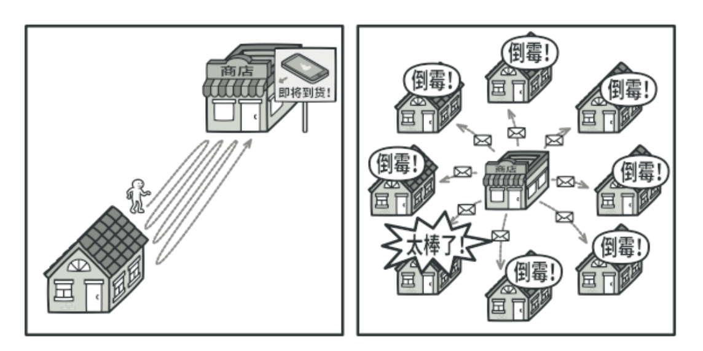
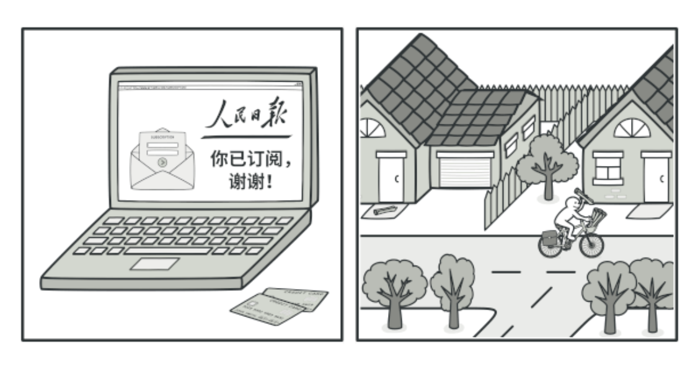

亦称： 事件订阅者、­ 监听者、­Event-Subscriber、­Listener、­Observer

意图
--

**观察者**是一种行为设计模式，允许你定义一种订阅机制，可在对象事件发生时通知多个 “观察” 该对象的其他对象。


问题
--

假如你有两种类型的对象：`顾客`和`商店`。顾客对某个特定品牌的产品非常感兴趣（例如最新型号的 iPhone 手机），而该产品很快将会在商店里出售。

顾客可以每天来商店看看产品是否到货。但如果商品尚未到货时，绝大多数来到商店的顾客都会空手而归。



前往商店和发送垃圾邮件

另一方面，每次新产品到货时，商店可以向所有顾客发送电子邮件（可能会被视为垃圾邮件）。这样，部分顾客就无需反复前往商店了，但也可能会惹恼对新产品没有兴趣的其他顾客。

我们似乎遇到了一个矛盾：要么让顾客浪费时间检查产品是否到货，要么让商店浪费资源去通知没有需求的顾客。

解决方案
----

拥有一些值得关注的状态的对象通常被称为​_目标_​，由于它要将自身的状态改变通知给其他对象，我们也将其称为​_发布者_​（publisher）。所有希望关注发布者状态变化的其他对象被称为​_订阅者_​（subscribers）。

观察者模式建议你为发布者类添加订阅机制，让每个对象都能订阅或取消订阅发布者事件流。不要害怕！这并不像听上去那么复杂。实际上，该机制包括 1）一个用于存储订阅者对象引用的列表成员变量；2）几个用于添加或删除该列表中订阅者的公有方法。


订阅机制允许对象订阅事件通知。

现在，无论何时发生了重要的发布者事件，它都要遍历订阅者并调用其对象的特定通知方法。

实际应用中可能会有十几个不同的订阅者类跟踪着同一个发布者类的事件，你不会希望发布者与所有这些类相耦合的。此外如果他人会使用发布者类，那么你甚至可能会对其中的一些类一无所知。

因此，所有订阅者都必须实现同样的接口，发布者仅通过该接口与订阅者交互。接口中必须声明通知方法及其参数，这样发布者在发出通知时还能传递一些上下文数据。


发布者通过调用订阅者对象中的特定通知方法来通知订阅者。

如果你的应用中有多个不同类型的发布者，且希望订阅者可兼容所有发布者，那么你甚至可以进一步让所有订阅者遵循同样的接口。该接口仅需描述几个订阅方法即可。这样订阅者就能在不与具体发布者类耦合的情况下通过接口观察发布者的状态。

真实世界类比
------


杂志和报纸订阅。

如果你订阅了一份杂志或报纸，那就不需要再去报摊查询新出版的刊物了。出版社（即应用中的 “发布者”）会在刊物出版后（甚至提前）直接将最新一期寄送至你的邮箱中。

出版社负责维护订阅者列表，了解订阅者对哪些刊物感兴趣。当订阅者希望出版社停止寄送新一期的杂志时，他们可随时从该列表中退出。

结构
--

1.  **发布者**（Publisher）会向其他对象发送值得关注的事件。事件会在发布者自身状态改变或执行特定行为后发生。发布者中包含一个允许新订阅者加入和当前订阅者离开列表的订阅构架。
    
2.  当新事件发生时，发送者会遍历订阅列表并调用每个订阅者对象的通知方法。该方法是在订阅者接口中声明的。
    
3.  **订阅者**（Subscriber）接口声明了通知接口。在绝大多数情况下，该接口仅包含一个`update`（更新）方法。该方法可以拥有多个参数，使发布者能在更新时传递事件的详细信息。
    
4.  **具体订阅者**（Concrete Subscribers）可以执行一些操作来回应发布者的通知。所有具体订阅者类都实现了同样的接口，因此发布者不需要与具体类相耦合。
    
5.  订阅者通常需要一些上下文信息来正确地处理更新。因此，发布者通常会将一些上下文数据作为通知方法的参数进行传递。发布者也可将自身作为参数进行传递，使订阅者直接获取所需的数据。
    
6.  **客户端**（Client）会分别创建发布者和订阅者对象，然后为订阅者注册发布者更新。
    

伪代码
---

在本例中，**观察者**模式允许文本编辑器对象将自身的状态改变通知给其他服务对象。


将对象中发生的事件通知给其他对象。

订阅者列表是动态生成的：对象可在运行时根据程序需要开始或停止监听通知。

在本实现中，编辑器类自身并不维护订阅列表。它将工作委派给专门从事此工作的一个特殊帮手对象。你还可将该对象升级为中心化的事件分发器，允许任何对象成为发布者。

只要发布者通过同样的接口与所有订阅者进行交互，那么在程序中新增订阅者时就无需修改已有发布者类的代码。

```
// 发布者基类包含订阅管理代码和通知方法。
class EventManager is
    private field listeners: hash map of event types and listeners

    method subscribe(eventType, listener) is
        listeners.add(eventType, listener)

    method unsubscribe(eventType, listener) is
        listeners.remove(eventType, listener)

    method notify(eventType, data) is
        foreach (listener in listeners.of(eventType)) do
            listener.update(data)

// 具体发布者包含一些订阅者感兴趣的实际业务逻辑。我们可以从发布者基类中扩
// 展出该类，但在实际情况下并不总能做到，因为具体发布者可能已经是子类了。
// 在这种情况下，你可用组合来修补订阅逻辑，就像我们在这里做的一样。
class Editor is
    public field events: EventManager
    private field file: File

    constructor Editor() is
        events = new EventManager()

    // 业务逻辑的方法可将变化通知给订阅者。
    method openFile(path) is
        this.file = new File(path)
        events.notify("open", file.name)

    method saveFile() is
        file.write()
        events.notify("save", file.name)

    


// 这里是订阅者接口。如果你的编程语言支持函数类型，则可用一组函数来代替整
// 个订阅者的层次结构。
interface EventListener is
    method update(filename)

// 具体订阅者会对其注册的发布者所发出的更新消息做出响应。
class LoggingListener implements EventListener is
    private field log: File
    private field message

    constructor LoggingListener(log_filename, message) is
        this.log = new File(log_filename)
        this.message = message

    method update(filename) is
        log.write(replace('%s',filename,message))

class EmailAlertsListener implements EventListener is
    private field email: string

    constructor EmailAlertsListener(email, message) is
        this.email = email
        this.message = message

    method update(filename) is
        system.email(email, replace('%s',filename,message))


// 应用程序可在运行时配置发布者和订阅者。
class Application is
    method config() is
        editor = new TextEditor()

        logger = new LoggingListener(
            "/path/to/log.txt",
            "有人打开了文件：%s");
        editor.events.subscribe("open", logger)

        emailAlerts = new EmailAlertsListener(
            "admin@example.com",
            "有人更改了文件：%s")
        editor.events.subscribe("save", emailAlerts)


```

适用性
---

当一个对象状态的改变需要改变其他对象，或实际对象是事先未知的或动态变化的时，可使用观察者模式。

当你使用图形用户界面类时通常会遇到一个问题。比如，你创建了自定义按钮类并允许客户端在按钮中注入自定义代码，这样当用户按下按钮时就会触发这些代码。

观察者模式允许任何实现了订阅者接口的对象订阅发布者对象的事件通知。你可在按钮中添加订阅机制，允许客户端通过自定义订阅类注入自定义代码。

当应用中的一些对象必须观察其他对象时，可使用该模式。但仅能在有限时间内或特定情况下使用。

订阅列表是动态的，因此订阅者可以随时加入或离开该列表。

实现方式
----

1.  仔细检查你的业务逻辑，试着将其拆分为两个部分：独立于其他代码的核心功能将作为发布者；其他代码则将转化为一组订阅类。
    
2.  声明订阅者接口。该接口至少应声明一个`update`方法。
    
3.  声明发布者接口并定义一些接口来在列表中添加和删除订阅对象。记住发布者必须仅通过订阅者接口与它们进行交互。
    
4.  确定存放实际订阅列表的位置并实现订阅方法。通常所有类型的发布者代码看上去都一样，因此将列表放置在直接扩展自发布者接口的抽象类中是显而易见的。具体发布者会扩展该类从而继承所有的订阅行为。
    
    但是，如果你需要在现有的类层次结构中应用该模式，则可以考虑使用组合的方式：将订阅逻辑放入一个独立的对象，然后让所有实际订阅者使用该对象。
    
5.  创建具体发布者类。每次发布者发生了重要事件时都必须通知所有的订阅者。
    
6.  在具体订阅者类中实现通知更新的方法。绝大部分订阅者需要一些与事件相关的上下文数据。这些数据可作为通知方法的参数来传递。
    
    但还有另一种选择。订阅者接收到通知后直接从通知中获取所有数据。在这种情况下，发布者必须通过更新方法将自身传递出去。另一种不太灵活的方式是通过构造函数将发布者与订阅者永久性地连接起来。
    
7.  客户端必须生成所需的全部订阅者，并在相应的发布者处完成注册工作。
    

优缺点
---

*   [开闭原则]。你无需修改发布者代码就能引入新的订阅者类（如果是发布者接口则可轻松引入发布者类）。
*   你可以在运行时建立对象之间的联系。

与其他模式的关系
--------

*   [职责链](https://refactoringguru.cn/design-patterns/chain-of-responsibility)、[命令](https://refactoringguru.cn/design-patterns/command)、[中介者](https://refactoringguru.cn/design-patterns/mediator)和[观察者](https://refactoringguru.cn/design-patterns/observer)用于处理请求发送者和接收者之间的不同连接方式：
    
    *   ​_职责链_​按照顺序将请求动态传递给一系列的潜在接收者，直至其中一名接收者对请求进行处理。
    *   ​_命令_​在发送者和请求者之间建立单向连接。
    *   ​_中介者_​清除了发送者和请求者之间的直接连接，强制它们通过一个中介对象进行间接沟通。
    *   ​_观察者_​允许接收者动态地订阅或取消接收请求。
*   [中介者](https://refactoringguru.cn/design-patterns/mediator)和[观察者](https://refactoringguru.cn/design-patterns/observer)之间的区别往往很难记住。在大部分情况下，你可以使用其中一种模式，而有时可以同时使用。让我们来看看如何做到这一点。
    
    ​_中介者_​的主要目标是消除一系列系统组件之间的相互依赖。这些组件将依赖于同一个中介者对象。​_观察者_​的目标是在对象之间建立动态的单向连接，使得部分对象可作为其他对象的附属发挥作用。
    
    有一种流行的中介者模式实现方式依赖于​_观察者_​。中介者对象担当发布者的角色，其他组件则作为订阅者，可以订阅中介者的事件或取消订阅。当​_中介者_​以这种方式实现时，它可能看上去与​_观察者_​非常相似。
    
    当你感到疑惑时，记住可以采用其他方式来实现中介者。例如，你可以永久性地将所有组件链接到同一个中介者对象。这种实现方式和​_观察者_​并不相同，但这仍然是一种中介者模式。
    
    假设有一个程序，其所有的组件都变成了发布者，它们之间可以相互建立动态连接。这样程序中就没有中心化的中介者对象，而只有一些分布式的观察者。


Typescript实现
-----

[代码参考](/code/observer/index.ts)


Javascript简易实现
-----

[代码参考](/code/observer/index.js)


应用场景
-------

观察者模式的应用场景非常广泛，小到代码层面的解耦，大到架构层面的系统解耦，再或者 一些产品的设计思路，都有这种模式的影子，比如，邮件订阅、RSS Feeds，本质上都是观察者模式。不同的应用场景和需求下，这个模式也有截然不同的实现方式，有同步阻塞的实 现方式，也有异步非阻塞的实现方式;有进程内的实现方式，也有跨进程的实现方式。

### 1、事件通信

前端[事件通信的eventbus](https://github.com/tomato-js/tomato/blob/df6f850/packages/events/src/Events.ts#L14)，和[vue的响应式数据管理系统](https://omnipotent-front-end.github.io/library/vue.html#vue%E4%B8%AD%E7%9A%84%E6%95%B0%E6%8D%AE%E5%93%8D%E5%BA%94%E5%BC%8F%E5%A6%82%E4%BD%95%E5%AE%9E%E7%8E%B0%E7%9A%84%EF%BC%9F)，都是观察者模式的运用。

