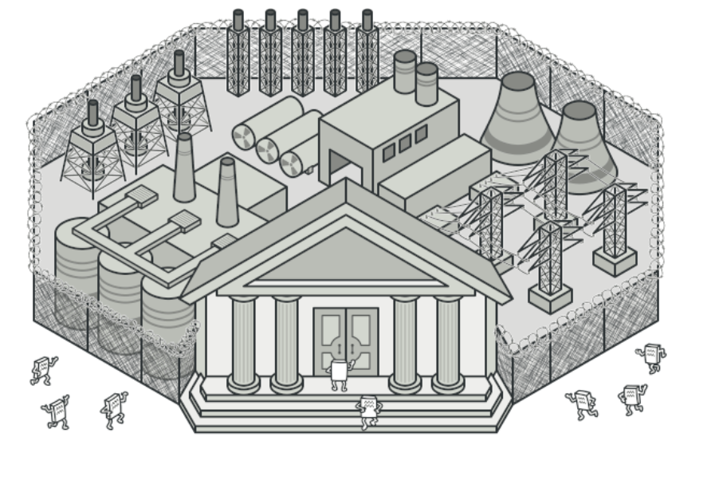

亦称： 门面模式、 Facade

意图
--

**外观模式**是一种结构型设计模式， 能为程序库、 框架或其他复杂类提供一个简单的接口。



问题
--

假设你必须在代码中使用某个复杂的库或框架中的众多对象。 正常情况下， 你需要负责所有对象的初始化工作、 管理其依赖关系并按正确的顺序执行方法等。

最终， 程序中类的业务逻辑将与第三方类的实现细节紧密耦合， 使得理解和维护代码的工作很难进行。

解决方案
----

外观类为包含许多活动部件的复杂子系统提供一个简单的接口。 与直接调用子系统相比， 外观提供的功能可能比较有限， 但它却包含了客户端真正关心的功能。

如果你的程序需要与包含几十种功能的复杂库整合， 但只需使用其中非常少的功能， 那么使用外观模式会非常方便，

例如， 上传猫咪搞笑短视频到社交媒体网站的应用可能会用到专业的视频转换库， 但它只需使用一个包含 `encode­(filename, format)`方法 （以文件名与文件格式为参数进行编码的方法） 的类即可。 在创建这个类并将其连接到视频转换库后， 你就拥有了自己的第一个外观。

真实世界类比
------


电话购物。

当你通过电话给商店下达订单时， 接线员就是该商店的所有服务和部门的外观。 接线员为你提供了一个同购物系统、 支付网关和各种送货服务进行互动的简单语音接口。

外观模式结构
------

1.  **外观** （Facade） 提供了一种访问特定子系统功能的便捷方式， 其了解如何重定向客户端请求， 知晓如何操作一切活动部件。
    
2.  创建**附加外观** （Additional Facade） 类可以避免多种不相关的功能污染单一外观， 使其变成又一个复杂结构。 客户端和其他外观都可使用附加外观。
    
3.  **复杂子系统** （Complex Subsystem） 由数十个不同对象构成。 如果要用这些对象完成有意义的工作， 你必须深入了解子系统的实现细节， 比如按照正确顺序初始化对象和为其提供正确格式的数据。
    
    子系统类不会意识到外观的存在， 它们在系统内运作并且相互之间可直接进行交互。
    
4.  **客户端** （Client） 使用外观代替对子系统对象的直接调用。
    

伪代码
---

在本例中， **外观**模式简化了客户端与复杂视频转换框架之间的交互。


使用单个外观类隔离多重依赖的示例

你可以创建一个封装所需功能并隐藏其他代码的外观类， 从而无需使全部代码直接与数十个框架类进行交互。 该结构还能将未来框架升级或更换所造成的影响最小化， 因为你只需修改程序中外观方法的实现即可。

```
// 这里有复杂第三方视频转换框架中的一些类。我们不知晓其中的代码，因此无法
// 对其进行简化。

class VideoFile


class OggCompressionCodec


class MPEG4CompressionCodec


class CodecFactory


class BitrateReader


class AudioMixer


// 为了将框架的复杂性隐藏在一个简单接口背后，我们创建了一个外观类。它是在
// 功能性和简洁性之间做出的权衡。
class VideoConverter is
    method convert(filename, format):File is
        file = new VideoFile(filename)
        sourceCodec = new CodecFactory.extract(file)
        if (format == "mp4")
            destinationCodec = new MPEG4CompressionCodec()
        else
            destinationCodec = new OggCompressionCodec()
        buffer = BitrateReader.read(filename, sourceCodec)
        result = BitrateReader.convert(buffer, destinationCodec)
        result = (new AudioMixer()).fix(result)
        return new File(result)

// 应用程序的类并不依赖于复杂框架中成千上万的类。同样，如果你决定更换框架，
// 那只需重写外观类即可。
class Application is
    method main() is
        convertor = new VideoConverter()
        mp4 = convertor.convert("funny-cats-video.ogg", "mp4")
        mp4.save()


```

外观模式适用性
-------

如果你需要一个指向复杂子系统的直接接口， 且该接口的功能有限， 则可以使用外观模式。

子系统通常会随着时间的推进变得越来越复杂。 即便是应用了设计模式， 通常你也会创建更多的类。 尽管在多种情形中子系统可能是更灵活或易于复用的， 但其所需的配置和样板代码数量将会增长得更快。 为了解决这个问题， 外观将会提供指向子系统中最常用功能的快捷方式， 能够满足客户端的大部分需求。

如果需要将子系统组织为多层结构， 可以使用外观。

创建外观来定义子系统中各层次的入口。 你可以要求子系统仅使用外观来进行交互， 以减少子系统之间的耦合。

让我们回到视频转换框架的例子。 该框架可以拆分为两个层次： 音频相关和视频相关。 你可以为每个层次创建一个外观， 然后要求各层的类必须通过这些外观进行交互。 这种方式看上去与[中介者](https://refactoringguru.cn/design-patterns/mediator)模式非常相似。

实现方式
----

1.  考虑能否在现有子系统的基础上提供一个更简单的接口。 如果该接口能让客户端代码独立于众多子系统类， 那么你的方向就是正确的。
    
2.  在一个新的外观类中声明并实现该接口。 外观应将客户端代码的调用重定向到子系统中的相应对象处。 如果客户端代码没有对子系统进行初始化， 也没有对其后续生命周期进行管理， 那么外观必须完成此类工作。
    
3.  如果要充分发挥这一模式的优势， 你必须确保所有客户端代码仅通过外观来与子系统进行交互。 此后客户端代码将不会受到任何由子系统代码修改而造成的影响， 比如子系统升级后， 你只需修改外观中的代码即可。
    
4.  如果外观变得[过于臃肿](https://refactoringguru.cn/smells/large-class)， 你可以考虑将其部分行为抽取为一个新的专用外观类。
    

与其他模式的关系
--------

*   [外观模式](https://refactoringguru.cn/design-patterns/facade)为现有对象定义了一个新接口， [适配器模式](https://refactoringguru.cn/design-patterns/adapter)则会试图运用已有的接口。 _适配器_通常只封装一个对象， _外观_通常会作用于整个对象子系统上。
    
*   当只需对客户端代码隐藏子系统创建对象的方式时， 你可以使用[抽象工厂模式](https://refactoringguru.cn/design-patterns/abstract-factory)来代替[外观](https://refactoringguru.cn/design-patterns/facade)。
    
*   [享元模式](https://refactoringguru.cn/design-patterns/flyweight)展示了如何生成大量的小型对象， [外观](https://refactoringguru.cn/design-patterns/facade)则展示了如何用一个对象来代表整个子系统。
    
*   [外观](https://refactoringguru.cn/design-patterns/facade)和[中介者模式](https://refactoringguru.cn/design-patterns/mediator)的职责类似： 它们都尝试在大量紧密耦合的类中组织起合作。
    
    *   _外观_为子系统中的所有对象定义了一个简单接口， 但是它不提供任何新功能。 子系统本身不会意识到外观的存在。 子系统中的对象可以直接进行交流。
    *   _中介者_将系统中组件的沟通行为中心化。 各组件只知道中介者对象， 无法直接相互交流。
*   [外观](https://refactoringguru.cn/design-patterns/facade)类通常可以转换为[单例模式](https://refactoringguru.cn/design-patterns/singleton)类， 因为在大部分情况下一个外观对象就足够了。
    
*   [外观](https://refactoringguru.cn/design-patterns/facade)与[代理模式](https://refactoringguru.cn/design-patterns/proxy)的相似之处在于它们都缓存了一个复杂实体并自行对其进行初始化。 _代理_与其服务对象遵循同一接口， 使得自己和服务对象可以互换， 在这一点上它与_外观_不同。


Typescript实现
-----

使用 TypeScript 开发的程序中会经常使用外观模式。 它在与复杂程序库和 API 协作时特别有用。

``` javascript
/**
 * Facade类提供了一个简单的接口，可以连接一个或多个
 * 几个子系统。 外立面将客户请求委托给
 * 子系统内的适当对象。 立面也负责
 * 管理其生命周期。 所有这些都使客户免受不必要的影响
 * 子系统的复杂性。
 */
class Facade {
  protected subsystem1: Subsystem1;

  protected subsystem2: Subsystem2;

  /**
   *根据您的应用程序的需求，您可以向Facade提供
   *现有子系统对象或强制Facade自行创建它们。
   */
  constructor(subsystem1: Subsystem1 = null, subsystem2: Subsystem2 = null) {
    this.subsystem1 = subsystem1 || new Subsystem1();
    this.subsystem2 = subsystem2 || new Subsystem2();
  }

  public operation(): string {
    let result = "Facade initializes subsystems:\n";
    result += this.subsystem1.operation1();
    result += this.subsystem2.operation1();
    result += "Facade orders subsystems to perform the action:\n";
    result += this.subsystem1.operationN();
    result += this.subsystem2.operationZ();

    return result;
  }
}

/**
 *子系统可以直接接受来自Facade或客户端的请求。
 *在任何情况下，对于子系统而言，Facade都是另一个客户端，并且不是
 *子系统的一部分。
 */
class Subsystem1 {
  public operation1(): string {
    return "Subsystem1: Ready!\n";
  }

  // ...

  public operationN(): string {
    return "Subsystem1: Go!\n";
  }
}

/**
 * Some facades can work with multiple subsystems at the same time.
 */
class Subsystem2 {
  public operation1(): string {
    return "Subsystem2: Get ready!\n";
  }

  // ...

  public operationZ(): string {
    return "Subsystem2: Fire!";
  }
}


// 应用程序的类并不依赖于复杂框架中成千上万的类。同样，如果你决定更换框架，
// 那只需重写外观类即可。
function clientFacade(facade: Facade) {
  // ...

  console.log(facade.operation());

  // ...
}

/**
 * The client code may have some of the subsystem's objects already created. In
 * this case, it might be worthwhile to initialize the Facade with these objects
 * instead of letting the Facade create new instances.
 */
const subsystem1 = new Subsystem1();
const subsystem2 = new Subsystem2();
const facade = new Facade(subsystem1, subsystem2);
clientFacade(facade);

// Facade initializes subsystems:
// Subsystem1: Ready!
// Subsystem2: Get ready!
// Facade orders subsystems to perform the action:
// Subsystem1: Go!
// Subsystem2: Fire!

```


Javascript简易实现
-----

``` javascript
class ShopFacade {
  constructor() {
    this.discount = new Discount();
    this.shipping = new Shipping();
    this.fees = new Fees();
  }

  calc(price) {
    price = this.discount.calc(price);
    price = this.fees.calc(price);
    price += this.shipping.calc();
    return price;
  }
}

class Discount {
  calc(value) {
    return value * 0.9;
  }
}

class Shipping {
  calc() {
    return 5;
  }
}

class Fees {
  calc(value) {
    return value * 1.05;
  }
}

export default ShopFacade;

```


应用场景
------

### 1、解决易用性

门面模式可以用来封装系统的底层实现，隐藏系统的复杂性，提供一组更加简单易用、更高层的接口。比如，Linux 系统调用函数就可以看作一种“门面”。它是 Linux 操作系统暴露给开发者的一组“特殊”的编程接口，它封装了底层更基础的 Linux 内核调用。再比如， Linux 的 Shell 命令，实际上也可以看作一种门面模式的应用。它继续封装系统调用，提供更加友好、简单的命令，让我们可以直接通过执行命令来跟操作系统交互。

前端各组件库中组件包含子组件，本身也是一种外观模式的应用。

又或者是封装一个简单的API对象，比如说：

``` js
class API {
  constructor(authToken) {
    this.authToken = authToken;
  }
  constructHeaders() {
    const headers = new Headers();
    headers.set('Authorization', this.authToken);
    return headers;
  }
  handleResponse(response) {
    if (response.ok) {
      return response.json();
    } else {
      return Promise.reject({
        status: response.status,
        statusText: response.statusText
      });
    }
  }
  get(url, options) {
    return fetch(url, {
      headers: this.constructHeaders(),
      ...options,
    })
      .then(this.handleResponse);
  }
  post(url, options) {
    return fetch(url, {
      method: 'POST',
      headers: this.constructHeaders(),
      ...options,
    })
      .then(this.handleResponse);
  }
  put(url, options) {
    return fetch(url, {
      method: 'PUT',
      headers: this.constructHeaders(),
      ...options,
    })
      .then(this.handleResponse);
  }
  delete(url, options) {
    return fetch(url, {
      method: 'DELETE',
      headers: this.constructHeaders(),
      ...options,
    })
      .then(this.handleResponse);
  }
}
```

使用起来就变得很方便：

``` js
const api = new API('my-auth-token');
 
api.get('https://jsonplaceholder.typicode.com/users/1')
  .then(data => {
    console.log('User data', data);
  })
  .catch(error => {
    console.error(error);
  });
```

#### 封装React Hooks

外观模式不仅可以用在对象里，也可以用在函数上，比如react的hooks中运用：

比如以下这段代码：

``` js
import React, { useState } from 'react';
import AddUserModal from './AddUserModal';
import UsersTable from './UsersTable';
 
const Users = () => {
  const [users, setUsers] = useState([]);
 
  const [isAddUserModalOpened, setAddUserModalVisibility] = useState(false);
 
  function openAddUserModal() {
    setAddUserModalVisibility(true);
  }
 
  function closeAddUserModal() {
    setAddUserModalVisibility(false);
  }
 
  function addUser(user) {
    setUsers([
      ...users,
      user
    ])
  }
 
  function deleteUser(userId) {
    const userIndex = users.findIndex(user => user.id === userId);
    if (userIndex > -1) {
      const newUsers = [...users];
      newUsers.splice(userIndex, 1);
      setUsers(
        newUsers
      );
    }
  }
 
  return (
    <>
      <button onClick={openAddUserModal}>Add user</button>
      <UsersTable
        users={users}
        onDelete={deleteUser}
      />
      <AddUserModal
        isOpened={isAddUserModalOpened}
        onClose={closeAddUserModal}
        onAddUser={addUser}
      />
    </>
  )
};
 
export default Users;
```

虽然看起来没什么问题，但是实际上还是可以通过把部分逻辑封装成hooks来进一步简化：

管理user的hooks：

``` js
function useUsersManagement() {
  const [users, setUsers] = useState([]);
 
  function addUser(user) {
    setUsers([
      ...users,
      user
    ])
  }
 
  function deleteUser(userId) {
    const userIndex = users.findIndex(user => user.id === userId);
    if (userIndex > -1) {
      const newUsers = [...users];
      newUsers.splice(userIndex, 1);
      setUsers(
        newUsers
      );
    }
  }
 
  return {
    users,
    addUser,
    deleteUser
  }
}
```

管理弹框的hooks：

``` js
function useAddUserModalManagement() {
  const [isAddUserModalOpened, setAddUserModalVisibility] = useState(false);
 
  function openAddUserModal() {
    setAddUserModalVisibility(true);
  }
 
  function closeAddUserModal() {
    setAddUserModalVisibility(false);
  }
  return {
    isAddUserModalOpened,
    openAddUserModal,
    closeAddUserModal
  }
}
```

最后再去调用：

``` js
import React from 'react';
import AddUserModal from './AddUserModal';
import UsersTable from './UsersTable';
import useUsersManagement from "./useUsersManagement";
import useAddUserModalManagement from "./useAddUserModalManagement";
 
const Users = () => {
  const {
    users,
    addUser,
    deleteUser
  } = useUsersManagement();
  const {
    isAddUserModalOpened,
    openAddUserModal,
    closeAddUserModal
  } = useAddUserModalManagement();
 
  return (
    <>
      <button onClick={openAddUserModal}>Add user</button>
      <UsersTable
        users={users}
        onDelete={deleteUser}
      />
      <AddUserModal
        isOpened={isAddUserModalOpened}
        onClose={closeAddUserModal}
        onAddUser={addUser}
      />
    </>
  )
};
 
export default Users;
```


参考：

[The Facade pattern and applying it to React Hooks](https://wanago.io/2019/12/09/javascript-design-patterns-facade-react-hooks/)


#### babel的预设presets

因为 babel 内部的 plugins 特别多，而且什么情况下用什么插件会比较复杂，如果让用户自己去装插件，那么就把复杂度直接暴露给用户了，所以才有了 preset 这一层，只需要简单的配置，然后由 preset 去选择具体的 plugin 来使用。

这个 preset 就是一层门面，简化了系统对外的复杂度。

多了一层处理，就可以很好的治理复杂度，就像我们会用 event 而不是直接调用方法一样，多了一层来隔离可以更好的控制复杂度，暴露简单的门面给用户。 

### 2、解决性能问题

我们通过将多个接口调用替换为一个门面接口调用，减少网络通信成本，提高 App 客户端的响应速度。

### 3、解决分布式事务问题

要支持两个接口调用在一个事务中执行，是比较难实现的，这涉及分布式事务问题。虽然我们可以通过引入分布式事务框架或者事后补偿的机制来解决，但代码实现都比较复杂。而最简单的解决方案是，利用数据库事务或者 Spring 框架提供的事务(如果是 Java 语言的 话)，在一个事务中，执行创建用户和创建钱包这两个 SQL 操作。这就要求两个 SQL 操作要在一个接口中完成，所以，我们可以借鉴门面模式的思想，再设计一个包裹这两个操作的新接口，让新接口在一个事务中执行两个 SQL 操作。


