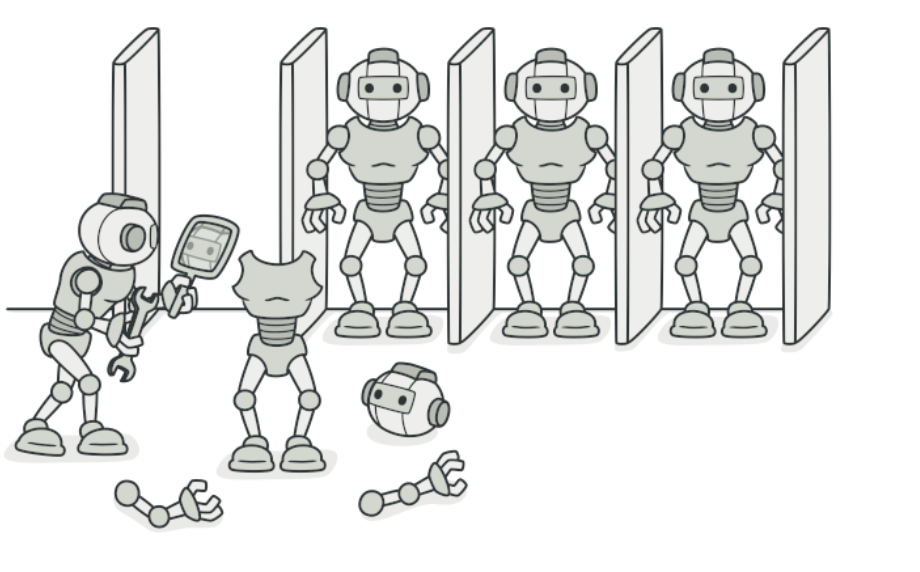
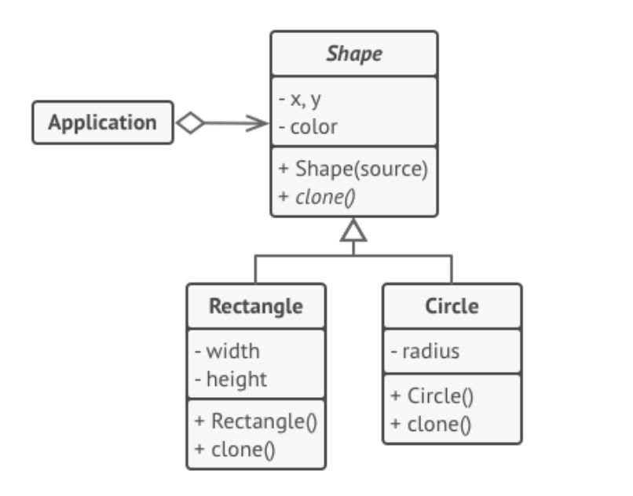

亦称： 克隆、 Clone、 Prototype

意图
--

**原型模式**是一种创建型设计模式， 使你能够复制已有对象， 而又无需使代码依赖它们所属的类。



问题
--

如果你有一个对象， 并希望生成与其完全相同的一个复制品， 你该如何实现呢？ 首先， 你必须新建一个属于相同类的对象。 然后， 你必须遍历原始对象的所有成员变量， 并将成员变量值复制到新对象中。

不错！ 但有个小问题。 并非所有对象都能通过这种方式进行复制， 因为有些对象可能拥有私有成员变量， 它们在对象本身以外是不可见的。


“从外部” 复制对象[并非](https://refactoringguru.cn/cargo-cult)总是可行。

直接复制还有另外一个问题。 因为你必须知道对象所属的类才能创建复制品， 所以**代码必须依赖该类**。 即使你可以接受额外的依赖性， 那还有另外一个问题： 有时你只知道对象所实现的接口， 而不知道其所属的具体类， 比如可向方法的某个参数传入实现了某个接口的任何对象。

解决方案
----

原型模式**将克隆过程委派给被克隆的实际对象**。 模式为所有支持克隆的对象**声明了一个通用接口， 该接口让你能够克隆对象， 同时又无需将代码和对象所属类耦合**。 通常情况下， 这样的接口中仅包含一个 `克隆`方法。

所有的类对 `克隆`方法的实现都非常相似。 该方法会创建一个当前类的对象， 然后将原始对象所有的成员变量值复制到新建的类中。 你甚至可以复制私有成员变量， 因为绝大部分编程语言都允许对象访问其同类对象的私有成员变量。

支持克隆的对象即为_原型_。 当你的对象有几十个成员变量和几百种类型时， 对其进行克隆甚至可以代替子类的构造。


预生成原型可以代替子类的构造。

其运作方式如下： 创建一系列不同类型的对象并不同的方式对其进行配置。 如果所需对象与预先配置的对象相同， 那么你只需克隆原型即可， 无需新建一个对象。

真实世界类比
------

现实生活中， 产品在得到大规模生产前会使用原型进行各种测试。 但在这种情况下， 原型只是一种被动的工具， 不参与任何真正的生产活动。


一个细胞的分裂。

由于工业原型并不是真正意义上的自我复制， 因此细胞有丝分裂 （还记得生物学知识吗？） 或许是更恰当的类比。 有丝分裂会产生一对完全相同的细胞。 原始细胞就是一个原型， 它在复制体的生成过程中起到了推动作用。

原型模式结构
------

#### 基本实现

1.  **原型** （Prototype） 接口将对克隆方法进行声明。 在绝大多数情况下， 其中只会有一个名为 `clone`克隆的方法。
    
2.  **具体原型** （Concrete Prototype） 类将实现克隆方法。 除了将原始对象的数据复制到克隆体中之外， 该方法有时还需处理克隆过程中的极端情况， 例如克隆关联对象和梳理递归依赖等等。
    
3.  **客户端** （Client） 可以复制实现了原型接口的任何对象。
    

#### 原型注册表实现

1.  **原型注册表** （Prototype Registry） 提供了一种访问常用原型的简单方法， 其中存储了一系列可供随时复制的预生成对象。 最简单的注册表原型是一个 `名称 → 原型`的哈希表。 但如果需要使用名称以外的条件进行搜索， 你可以创建更加完善的注册表版本。
    

伪代码
---

在本例中， **原型**模式能让你生成完全相同的几何对象副本， 同时无需代码与对象所属类耦合。



克隆一系列位于同一类层次结构中的对象。

所有形状类都遵循同一个提供克隆方法的接口。 在复制自身成员变量值到结果对象前， 子类可调用其父类的克隆方法。

```
// 基础原型。
abstract class Shape is
    field X: int
    field Y: int
    field color: string

    // 常规构造函数。
    constructor Shape() is
        

    // 原型构造函数。使用已有对象的数值来初始化一个新对象。
    constructor Shape(source: Shape) is
        this()
        this.X = source.X
        this.Y = source.Y
        this.color = source.color

    // clone（克隆）操作会返回一个形状子类。
    abstract method clone():Shape


// 具体原型。克隆方法会创建一个新对象并将其传递给构造函数。直到构造函数运
// 行完成前，它都拥有指向新克隆对象的引用。因此，任何人都无法访问未完全生
// 成的克隆对象。这可以保持克隆结果的一致。
class Rectangle extends Shape is
    field width: int
    field height: int

    constructor Rectangle(source: Rectangle) is
        // 需要调用父构造函数来复制父类中定义的私有成员变量。
        super(source)
        this.width = source.width
        this.height = source.height

    method clone():Shape is
        return new Rectangle(this)


class Circle extends Shape is
    field radius: int

    constructor Circle(source: Circle) is
        super(source)
        this.radius = source.radius

    method clone():Shape is
        return new Circle(this)


// 客户端代码中的某个位置。
class Application is
    field shapes: array of Shape

    constructor Application() is
        Circle circle = new Circle()
        circle.X = 10
        circle.Y = 10
        circle.radius = 20
        shapes.add(circle)

        Circle anotherCircle = circle.clone()
        shapes.add(anotherCircle)
        // 变量 `anotherCircle（另一个圆）`与 `circle（圆）`对象的内
        // 容完全一样。

        Rectangle rectangle = new Rectangle()
        rectangle.width = 10
        rectangle.height = 20
        shapes.add(rectangle)

    method businessLogic() is
        // 原型是很强大的东西，因为它能在不知晓对象类型的情况下生成一个与
        // 其完全相同的复制品。
        Array shapesCopy = new Array of Shapes.

        // 例如，我们不知晓形状数组中元素的具体类型，只知道它们都是形状。
        // 但在多态机制的帮助下，当我们在某个形状上调用 `clone（克隆）`
        // 方法时，程序会检查其所属的类并调用其中所定义的克隆方法。这样，
        // 我们将获得一个正确的复制品，而不是一组简单的形状对象。
        foreach (s in shapes) do
            shapesCopy.add(s.clone())

        // `shapesCopy（形状副本）`数组中包含 `shape（形状）`数组所有
        // 子元素的复制品。


```

原型模式适用性
-------

如果你需要复制一些对象， 同时又希望代码**独立于这些对象所属的具体类**， 可以使用原型模式。


当直接创建对象的代价比较大时，也可采用这种模式。例如，一个对象需要在一个高代价的数据库操作之后被创建。我们可以缓存该对象，在下一个请求时返回它的克隆，在需要的时候更新数据库，以此来减少数据库调用。

这一点考量通常出现在代码需要处理第三方代码通过接口传递过来的对象时。 即使不考虑代码耦合的情况， 你的代码也不能依赖这些对象所属的具体类， 因为你不知道它们的具体信息。

原型模式为客户端代码提供一个通用接口， 客户端代码可通过这一接口与所有实现了克隆的对象进行交互， 它也使得客户端代码与其所克隆的对象具体类独立开来。

如果子类的区别仅在于其对象的初始化方式， 那么你可以使用该模式来减少子类的数量。 别人创建这些子类的目的可能是为了创建特定类型的对象。

在原型模式中， 你可以使用一系列预生成的、 各种类型的对象作为原型。

客户端不必根据需求对子类进行实例化， 只需找到合适的原型并对其进行克隆即可。

实现方式
----

1.  创建原型接口， 并在其中声明 `克隆`方法。 如果你已有类层次结构， 则只需在其所有类中添加该方法即可。
    
2.  原型类必须另行定义一个以该类对象为参数的构造函数。 构造函数必须复制参数对象中的所有成员变量值到新建实体中。 如果你需要修改子类， 则必须调用父类构造函数， 让父类复制其私有成员变量值。
    
    如果编程语言不支持方法重载， 那么你可能需要定义一个特殊方法来复制对象数据。 在构造函数中进行此类处理比较方便， 因为它在调用 `new`运算符后会马上返回结果对象。
    
3.  克隆方法通常只有一行代码： 使用 `new`运算符调用原型版本的构造函数。 注意， 每个类都必须显式重写克隆方法并使用自身类名调用 `new`运算符。 否则， 克隆方法可能会生成父类的对象。
    
4.  你还可以创建一个中心化原型注册表， 用于存储常用原型。
    
    你可以新建一个工厂类来实现注册表， 或者在原型基类中添加一个获取原型的静态方法。 该方法必须能够根据客户端代码设定的条件进行搜索。 搜索条件可以是简单的字符串， 或者是一组复杂的搜索参数。 找到合适的原型后， 注册表应对原型进行克隆， 并将复制生成的对象返回给客户端。
    
    最后还要将对子类构造函数的直接调用替换为对原型注册表工厂方法的调用。
    

原型模式优缺点
-------

*   你可以克隆对象， 而无需与它们所属的具体类相耦合。
*   你可以克隆预生成原型， 避免反复运行初始化代码。
*   你可以更方便地生成复杂对象。
*   你可以用继承以外的方式来处理复杂对象的不同配置。


Typescript实现
-----

TypeScript 的 Cloneable  （克隆） 接口就是立即可用的原型模式。

``` javascript
// 基础原型。
class Prototype {
    public primitive: any;
    public component: object;
    public circularReference: ComponentWithBackReference;
    // clone（克隆）操作会返回一个类。
    public clone(): this {
        const clone = Object.create(this);

        clone.component = Object.create(this.component);

        // Cloning an object that has a nested object with backreference
        // requires special treatment. After the cloning is completed, the
        // nested object should point to the cloned object, instead of the
        // original object. Spread operator can be handy for this case.
        clone.circularReference = {
            ...this.circularReference,
            prototype: { ...this },
        };

        return clone;
    }
}
class ComponentWithBackReference {
    public prototype;

    constructor(prototype: Prototype) {
        this.prototype = prototype;
    }
}

/**
 * The client code.
 */
function clientPrototype() {
    const p1 = new Prototype();
    p1.primitive = 245;
    p1.component = new Date();
    p1.circularReference = new ComponentWithBackReference(p1);

    const p2 = p1.clone();
    if (p1.primitive === p2.primitive) {
        console.log('Primitive field values have been carried over to a clone. Yay!');
    } else {
        console.log('Primitive field values have not been copied. Booo!');
    }
    if (p1.component === p2.component) {
        console.log('Simple component has not been cloned. Booo!');
    } else {
        console.log('Simple component has been cloned. Yay!');
    }

    if (p1.circularReference === p2.circularReference) {
        console.log('Component with back reference has not been cloned. Booo!');
    } else {
        console.log('Component with back reference has been cloned. Yay!');
    }

    if (p1.circularReference.prototype === p2.circularReference.prototype) {
        console.log('Component with back reference is linked to original object. Booo!');
    } else {
        console.log('Component with back reference is linked to the clone. Yay!');
    }
}

clientPrototype();

// Primitive field values have been carried over to a clone. Yay!
// Simple component has been cloned. Yay!
// Component with back reference has been cloned. Yay!
// Component with back reference is linked to the clone. Yay!
```


Javascript简易实现
-----

``` javascript
class Sheep {

    constructor(name, weight) {
      this.name = name;
      this.weight = weight;
    }
  
    clone() {
      return new Sheep(this.name, this.weight);
    }
  }
  
  export default Sheep;
```


应用场景
-----

1、根据已有原型来创建对象

``` javascript
   let a = Object.create(Object.getPrototypeOf(b))
```

如果是普通的键值对，不需要拷贝原型，直接用Object.assign即可，因为其直接拷贝可枚举属性。

2、性能优化场景

比如一个对象需要在一个高代价的数据库操作之后被创建。我们可以缓存该对象，在下一个请求时返回它的克隆，在需要的时候更新数据库，以此来减少数据库调用。

