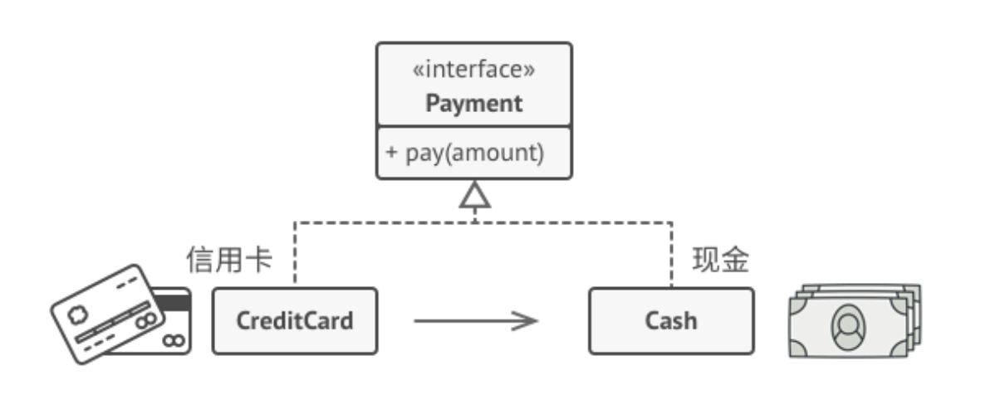

亦称： Proxy

意图
--

**代理**是一种结构型设计模式，让你能够提供对象的替代品或其占位符。代理控制着对于原对象的访问，并允许在将请求提交给对象前后进行一些处理。


问题
--

为什么要控制对于某个对象的访问呢？举个例子：有这样一个消耗大量系统资源的巨型对象，你只是偶尔需要使用它，并非总是需要。


数据库查询有可能会非常缓慢。

你可以实现延迟初始化：在实际有需要时再创建该对象。对象的所有客户端都要执行延迟初始代码。不幸的是，这很可能会带来很多重复代码。

在理想情况下，我们希望将代码直接放入对象的类中，但这并非总是能实现：比如类可能是第三方封闭库的一部分。

解决方案
----

代理模式建议新建一个与原服务对象接口相同的代理类，然后更新应用以将代理对象传递给所有原始对象客户端。代理类接收到客户端请求后会创建实际的服务对象，并将所有工作委派给它。


代理将自己伪装成数据库对象，可在客户端或实际数据库对象不知情的情况下处理延迟初始化和缓存查询结果的工作。

这有什么好处呢？如果需要在类的**主要业务逻辑前后执行一些工作**，你无需修改类就能完成这项工作。由于代理实现的接口与原类相同，因此你可将其传递给任何一个使用实际服务对象的客户端。

真实世界类比
------



信用卡和现金在支付过程中的用处相同。

信用卡是银行账户的代理，而银行账户则是一大捆现金的代理。它们都实现了同样的接口，均可用于进行支付。消费者会非常满意，因为他们不必随身携带大量现金；商店老板同样会十分高兴，因为交易收入能以电子化的方式进入到商店的银行账户中，无需担心存款时出现现金丢失或被抢劫的情况。

结构
--

1.  **服务接口**（Service Interface）声明了服务接口。代理必须遵循该接口才能伪装成服务对象。
    
2.  **服务**（Service）类提供了一些实用的业务逻辑。
    
3.  **代理**（Proxy）类包含一个指向服务对象的引用成员变量。代理完成其任务（例如延迟初始化、记录日志、访问控制和缓存等）后会将请求传递给服务对象。
    
    通常情况下，代理会对其服务对象的整个生命周期进行管理。
    
4.  **客户端**（Client）能通过同一接口与服务或代理进行交互，所以你可在一切需要服务对象的代码中使用代理。
    

伪代码
---

本例演示如何使用**代理**模式在第三方腾讯视频（TencentVideo，代码示例中记为 TV）程序库中添加延迟初始化和缓存。


使用代理缓冲服务结果。

程序库提供了视频下载类。但是该类的效率非常低。如果客户端程序多次请求同一视频，程序库会反复下载该视频，而不会将首次下载的文件缓存下来复用。

代理类实现和原下载器相同的接口，并将所有工作委派给原下载器。不过，代理类会保存所有的文件下载记录，如果程序多次请求同一文件，它会返回缓存的文件。

```
// 远程服务接口。
interface ThirdPartyTVLib is
    method listVideos()
    method getVideoInfo(id)
    method downloadVideo(id)

// 服务连接器的具体实现。该类的方法可以向腾讯视频请求信息。请求速度取决于
// 用户和腾讯视频的互联网连接情况。如果同时发送大量请求，即使所请求的信息
// 一模一样，程序的速度依然会减慢。
class ThirdPartyTVClass implements ThirdPartyTVLib is
    method listVideos() is
        // 向腾讯视频发送一个 API 请求。

    method getVideoInfo(id) is
        // 获取某个视频的元数据。

    method downloadVideo(id) is
        // 从腾讯视频下载一个视频文件。

// 为了节省网络带宽，我们可以将请求结果缓存下来并保存一段时间。但你可能无
// 法直接将这些代码放入服务类中。比如该类可能是第三方程序库的一部分或其签
// 名是`final`（最终）。因此我们会在一个实现了服务类接口的新代理类中放入
// 缓存代码。当代理类接收到真实请求后，才会将其委派给服务对象。
class CachedTVClass implements ThirdPartyTVLib is
    private field service: ThirdPartyTVClass
    private field listCache, videoCache
    field needReset

    constructor CachedTVClass(service: ThirdPartyTVLib) is
        this.service = service

    method listVideos() is
        if (listCache == null || needReset)
            listCache = service.listVideos()
        return listCache

    method getVideoInfo(id) is
        if (videoCache == null || needReset)
            videoCache = service.getVideoInfo(id)
        return videoCache

    method downloadVideo(id) is
        if (!downloadExists(id) || needReset)
            service.downloadVideo(id)

// 之前直接与服务对象交互的 GUI 类不需要改变，前提是它仅通过接口与服务对
// 象交互。我们可以安全地传递一个代理对象来代替真实服务对象，因为它们都实
// 现了相同的接口。
class TVManager is
    protected field service: ThirdPartyTVLib

    constructor TVManager(service: ThirdPartyTVLib) is
        this.service = service

    method renderVideoPage(id) is
        info = service.getVideoInfo(id)
        // 渲染视频页面。

    method renderListPanel() is
        list = service.listVideos()
        // 渲染视频缩略图列表。

    method reactOnUserInput() is
        renderVideoPage()
        renderListPanel()

// 程序可在运行时对代理进行配置。
class Application is
    method init() is
        aTVService = new ThirdPartyTVClass()
        aTVProxy = new CachedTVClass(aTVService)
        manager = new TVManager(aTVProxy)
        manager.reactOnUserInput()


```

适用性
---

使用代理模式的方式多种多样，让我们来看看最常见的几种。

延迟初始化（虚拟代理）。如果你有一个偶尔使用的重量级服务对象，一直保持该对象运行会消耗系统资源时，可使用代理模式。

你无需在程序启动时就创建该对象，可**将对象的初始化延迟到真正有需要的时候**。

访问控制（保护代理）。如果你只希望特定客户端使用服务对象，这里的对象可以是操作系统中非常重要的部分，而客户端则是各种已启动的程序（包括恶意程序），此时可使用代理模式。

代理可仅在客户端凭据满足一定要求时将请求传递给服务对象。

本地执行远程服务（远程代理）。适用于服务对象位于远程服务器上的情形。

在这种情形中，代理通过网络传递客户端请求，负责处理所有与网络相关的复杂细节。

记录日志请求（日志记录代理）。适用于当你需要保存对于服务对象的请求历史记录时。

代理可以在向服务传递请求前进行记录。

缓存请求结果（缓存代理）。适用于需要缓存客户请求结果并对缓存生命周期进行管理时，特别是当返回结果的体积非常大时。

代理可对重复请求所需的相同结果进行缓存，还可使用请求参数作为索引缓存的键值。

智能引用。可在没有客户端使用某个重量级对象时立即销毁该对象。。

代理会将所有获取了指向服务对象或其结果的客户端记录在案。代理会时不时地遍历各个客户端，检查它们是否仍在运行。如果相应的客户端列表为空，代理就会销毁该服务对象，释放底层系统资源。

代理还可以记录客户端是否修改了服务对象。其他客户端还可以复用未修改的对象。

实现方式
----

1.  如果没有现成的服务接口，你就需要创建一个接口来实现代理和服务对象的可交换性。从服务类中提取接口并非总是可行的，因为你需要对服务的所有客户端进行修改，让它们使用接口。备选计划是将代理作为服务类的子类，这样代理就能继承服务的所有接口了。
    
2.  创建代理类，其中必须包含一个存储指向服务的引用的成员变量。通常情况下，代理负责创建服务对象并对其整个生命周期进行管理。在一些特殊情况下，客户端会通过构造函数将服务传递给代理。
    
3.  根据需求实现代理方法。在大部分情况下，代理在完成一些任务后应将工作委派给服务对象。
    
4.  可以考虑新建一个创建方法来判断客户端可获取的是代理还是实际服务。你可以在代理类中创建一个简单的静态方法，也可以创建一个完整的工厂方法。
    
5.  可以考虑为服务对象实现延迟初始化。
    

优缺点
---

*   你可以在客户端毫无察觉的情况下控制服务对象。
*   如果客户端对服务对象的生命周期没有特殊要求，你可以对生命周期进行管理。
*   即使服务对象还未准备好或者不存在，代理也可以正常工作。
*   [开闭原则]。你可以在不对服务或客户端做出修改的情况下创建新代理。

*   代码可能会变得复杂，因为需要新建许多类。
*   服务响应可能会延迟。

与其他模式的关系
--------

*   [适配器](https://refactoringguru.cn/design-patterns/adapter)能为被封装对象提供不同的接口，[代理](https://refactoringguru.cn/design-patterns/proxy)能为对象提供相同的接口，[装饰](https://refactoringguru.cn/design-patterns/decorator)则能为对象提供加强的接口。
    
*   [外观](https://refactoringguru.cn/design-patterns/facade)与[代理](https://refactoringguru.cn/design-patterns/proxy)的相似之处在于它们都缓存了一个复杂实体并自行对其进行初始化。​_代理_​与其服务对象遵循同一接口，使得自己和服务对象可以互换，在这一点上它与​_外观_​不同。
    
*   [装饰](https://refactoringguru.cn/design-patterns/decorator)和[代理](https://refactoringguru.cn/design-patterns/proxy)有着相似的结构，但是其意图却非常不同。这两个模式的构建都基于组合原则，也就是说一个对象应该将部分工作委派给另一个对象。两者之间的不同之处在于​_代理_​通常自行管理其服务对象的生命周期，而​_装饰_​的生成则总是由客户端进行控制。
    


Typescript实现
-----

尽管在大多数TypeScript应用程序中，代理模式并不是常客，但在某些特殊情况下，它仍然非常方便。如果要在不更改客户端代码的情况下向现有类的对象添加一些其他行为，则这是不可替代的。

``` javascript

//“服务接口”,“服务”和“代理”都需要遵循该接口
interface Subject {
  request(): void;
}

//“服务”，包含真实的业务逻辑
class RealSubject implements Subject {
  public request(): void {
    console.log("RealSubject: Handling request.");
  }
}

//代理类，对“服务”进行方法增强
class ProxyClass implements Subject {
  private realSubject: RealSubject;

  /**
   * The Proxy maintains a reference to an object of the RealSubject class. It
   * can be either lazy-loaded or passed to the Proxy by the client.
   */
  constructor(realSubject: RealSubject) {
    this.realSubject = realSubject;
  }

  //代理了“服务”的request方法，并进行日志管理
  public request(): void {
    if (this.checkAccess()) {
      this.realSubject.request();
      this.logAccess();
    }
  }

  private checkAccess(): boolean {
    // Some real checks should go here.
    console.log("Proxy: Checking access prior to firing a real request.");

    return true;
  }

  private logAccess(): void {
    console.log("Proxy: Logging the time of request.");
  }
}

/**
 * The client code is supposed to work with all objects (both subjects and
 * proxies) via the Subject interface in order to support both real subjects and
 * proxies. In real life, however, clients mostly work with their real subjects
 * directly. In this case, to implement the pattern more easily, you can extend
 * your proxy from the real subject's class.
 */
function clientCodeProxy(subject: Subject) {
  // ...

  subject.request();

  // ...
}
//正常使用“服务”
console.log("Client: Executing the client code with a real subject:");
const realSubject = new RealSubject();
clientCodeProxy(realSubject);

console.log("");
//将“服务”代理后再使用
console.log("Client: Executing the same client code with a proxy:");
const proxy = new ProxyClass(realSubject);
clientCodeProxy(proxy);


// Client: Executing the client code with a real subject:
// RealSubject: Handling request.

// Client: Executing the same client code with a proxy:
// Proxy: Checking access prior to firing a real request.
// RealSubject: Handling request.
// Proxy: Logging the time of request.
```


Javascript简易实现
-----

``` javascript
class Car {
  drive() {
    return "driving";
  }
}

class CarProxy {
  constructor(driver) {
    this.driver = driver;
  }
  drive() {
    return this.driver.age < 18 ? "too young to drive" : new Car().drive();
  }
}

class Driver {
  constructor(age) {
    this.age = age;
  }
}

export { Car, CarProxy, Driver };

```


应用场景
-----

1、AOP

如果你熟悉 Java 语言和 Spring 开发框架，这部分工作都是可以在Spring AOP 切面中完 成的。Spring AOP 底层的实现原理就是基于动态代理。

在node端要好几个库做这个事情：[bnoguchi/hooks-js](https://github.com/bnoguchi/hooks-js#readme)、[cujojs/meld](https://github.com/cujojs/meld)。

ES2015规范引入了一个名为Proxy的全局对象，它可以从开始在Node.js v6.0中使用，也是代理模式的应用场景。

Vue3/MobX均是基于Proxy来完成对数据响应式的建设。

2、RPC框架

通过远程代理，将网络通信、数据编解码等细节隐藏起来。客户端在使用 RPC 服务的时候，就像使用本地函数一样，无需了解跟服务器交互的细节。除此之外，RPC 服务的开发者也只需要开发业务逻辑，就像开发本地使用的函数一样，不需要关注跟客户端的交互细节。

3、缓存

在应用启动的时 候，我们从配置文件中加载需要支持缓存的接口，以及相应的缓存策略(比如过期时间) 等。当请求到来的时候，我们在 AOP 切面中拦截请求，如果请求中带有支持缓存的字段 (比如 http://...?..&cached=true)，我们便从缓存(内存缓存或者 Redis 缓存等)中获 取数据直接返回。

4、业务中的非功能性需求开发

代理模式最常用的一个应用场景就是，在业务系统中开发一些非功能性需求，比如:监控、统计、鉴权、限流、事务、幂等、日志。我们将这些附加功能与业务功能解耦，放到代理类中统一处理，让程序员只需要关注业务方面的开发。


